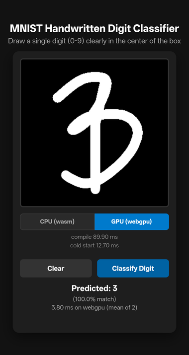

# CPU vs GPU Inference in the Browser

**A [LiteRT.js](https://ai.google.dev/edge/litert/web) benchmark: WebAssembly
against WebGPU, measured on a hand-drawn MNIST digit classifier.** The classifier
is the vehicle, not the subject — it exists to give both backends identical work
so their cost can be compared.

<p align="center">
  
</p>

Draw a digit, classify it, then flip the backend and run the same drawing through
the other one. Every figure the UI shows — compile, cold start, steady state — is
part of the comparison.

**Result: the CPU wins on every device tested**, by **17.9×** against a real
mobile GPU. A [second experiment](#second-experiment-direct-webgpu) rewrote the
same inference directly against the WebGPU API to find out why: a dispatch costs
well under a millisecond, and **~3 ms of per-call overhead remains** — the latency
of a synchronous GPU round-trip, not of the arithmetic. That experiment also
reported that removing LiteRT.js bought 1.34× — **which turned out to be an
under-sampling artefact.** Properly sampled, LiteRT.js is *faster* than the
hand-written page, by 2.03×, and [tracing why](#traced-why-litertjs-is-faster)
shows the gap is that round-trip: LiteRT overlaps it and the hand-written page
stalls on it. It is hideable by pipelining — a one-deep pipeline makes the
hand-written page beat LiteRT — but any *single* classification still pays it in
full, and even pipelined the GPU stays above the CPU.

A [third experiment](#third-experiment-a-model-built-into-the-browser) removed
JavaScript from the question altogether, putting the model *inside* a custom
Chromium build as a Web API. It does not close the gap either — **the CPU is
still 18× ahead**, which is the strongest evidence yet that the residual overhead
is WebGPU's request-response floor rather than anything a page can be blamed for.
That experiment runs on a different browser from the two above, and its numbers
are kept separate throughout.

### Two browsers, deliberately kept apart

Both are installed on the same OnePlus CPH2653, and **their numbers are never
mixed in one table**:

| | Browser | Used by |
| --- | --- | --- |
| **Stock** | Chrome **150.0.7871.188** (`com.android.chrome`) | the [performance report](#performance-report), the [finding](#finding-the-gpu-is-slower-than-the-cpu), the [second experiment](#second-experiment-direct-webgpu) |
| **Custom** | locally built Chromium **153.0.8005.0** release (`org.chromium.chrome`) | the [third experiment](#third-experiment-a-model-built-into-the-browser) |

The custom build is the only one that can run `browser-model-api.html` at all —
`navigator.digitclassifier` does not exist in a shipping browser. It is three
milestones newer than the stock Chrome, and not an official build, so **a figure
from one section cannot be compared with a figure from the other.** Comparisons
within a section are sound; across sections they are not, and where the two
disagree that is called out rather than reconciled.

See the [performance report](#performance-report) for the numbers, the
[finding](#finding-the-gpu-is-slower-than-the-cpu) for why, and
[the experiment](#the-experiment) for how they were measured.

## Current numbers

**OnePlus CPH2653**, **stock Chrome 150.0.7871.188**, content served from the
Pages site over HTTPS, clocks fixed, Chrome force-stopped between pages, 3
sessions × 5 samples each. Every figure below is taken with the **fixed-count
harness at a run count high enough that the median has stopped moving** — see
[how many runs a measurement needs](#the-cpu-baseline-and-how-many-runs-a-measurement-needs).

| Implementation | Page | Median | CV | vs CPU |
| --- | --- | ---: | ---: | ---: |
| **LiteRT.js — CPU (`wasm`)** | `index.html` | **0.090 ms** | **0.0%** | 1.00× |
| LiteRT.js — GPU (`webgpu`) | `index.html` | **1.610 ms** | 2.1% | **17.9×** |
| Direct WebGPU — fused | `webgpu.html` | **3.270 ms** | 1.9% | **36.3×** |

**The CPU is 17.9× faster than the best GPU path.** Hand-writing the WebGPU path
does not help: it is 2.03× slower than the runtime it was written to beat.

> [!NOTE]
> The **3.270 ms** direct-WebGPU figure predates two fixes, and the second one
> reverses the sentence above. After
> [tracing why LiteRT is faster](#traced-why-litertjs-is-faster), `webgpu.html`'s
> `run()` was changed to issue the compute and the readback as two separate
> submits (**~2.75 ms** fused,
> [data](docs/measurements/2026-08-24-webgpu-two-submit.md)) — and then the
> remaining gap turned out not to be the round-trip at all but **Chrome's lazy
> fence servicing**: polling `onSubmittedWorkDone` while the `mapAsync` is
> pending measured fused at **~0.38 ms** and per-layer at **~0.41 ms** across two
> sessions, past LiteRT by ~4×
> ([data](docs/measurements/2026-08-24-webgpu-mapasync-poll.md)). Output stays
> bit-identical; nothing is pipelined — each call still waits for its own result.
> The table keeps the rigorously-sampled 3.270 ms until the fix is re-measured
> from the Pages site with the full 3-session protocol; when it is, the
> hand-written page becomes the fastest GPU path and the CPU's margin over the
> GPU narrows from 17.9× to ~4×.

Raw data:
[CPU baseline and run-count sweep](docs/measurements/2026-08-24-stock-chrome-cpu-baseline.md)
·
[LiteRT vs direct WebGPU](docs/measurements/2026-08-24-stock-chrome-litert-vs-webgpu.md).

> [!NOTE]
> Everything below this section was measured with the **older, budget-driven
> harness**, most of it at a 5 ms budget where the GPU rows carried CVs of
> 45–55%. Those sections are kept as measured — they carry the reasoning that
> produced the findings — but where a number there disagrees with the table
> above, **the table above is the current one.** Figures from the two harnesses
> must not be pooled.

## Performance report

> [!WARNING]
> **Superseded.** These are old-harness figures, kept for the reasoning and the
> DVFS method they document. The CPU row in particular is biased: at the budget
> used here the CPU path was sampled over too short a burst to reach its clock.
> Current figures are in [Current numbers](#current-numbers).

Measured on a **OnePlus CPH2653** (Android 16, real GPU) running **stock Chrome
150.0.7871.188**, with the device held at a fixed clock — see
[method](#getting-numbers-that-reproduce). 3 runs × 5 measurements per backend,
GPU first then CPU in every run.

> These are stock-Chrome numbers. The custom-Chromium ones live in the
> [third experiment](#third-experiment-a-model-built-into-the-browser) and are
> kept separate on purpose — see [two browsers](#two-browsers-deliberately-kept-apart).

### One-time costs, paid before a backend can classify anything

| | Run 1 | Run 2 | Run 3 |
| --- | --- | --- | --- |
| GPU compile | 89.50 ms | 88.10 ms | 86.90 ms |
| CPU compile | 15.60 ms | 11.50 ms | 13.70 ms |
| GPU cold start (1st inference) | 15.40 ms | 12.30 ms | 14.90 ms |
| CPU cold start (1st inference) | 2.80 ms | 2.90 ms | 4.60 ms |

Choosing the GPU costs **~87–90 ms to compile plus ~12–15 ms for its first
inference** — roughly 100 ms before it classifies anything, against ~15 ms for
the CPU. Compile times are highly reproducible (GPU within 2.6 ms across runs).

Cold start here is not the worst case. A first-ever run measured **69.7 ms of
cold start**, ~5× these figures. I originally attributed that to Chrome's shader
cache persisting across runs; a later experiment on the second page
[disproved that](#three-regimes-not-two) — wiping Chrome's entire profile does
not reproduce the effect. The cost is GPU-process and driver bring-up, paid about
once per session rather than once per page.

### Steady-state cost per inference

| Backend | Run 1 | Run 2 | Run 3 | All 15 | Variability |
| --- | --- | --- | --- | --- | --- |
| **CPU (`wasm`)** | 0.56 | 0.56 | 0.59 | **median 0.56 ms** (0.54 – 0.77) | 1.4× spread, **CV 9.5%** |
| **GPU (`webgpu`)** | 4.20 | 5.55 | 4.75 | **median 4.30 ms** (2.07 – 12.10) | 5.8× spread, **CV 49.1%** |

### **The CPU is 7.7× faster** — 0.56 ms against 4.30 ms

**Why:** one inference is only ~0.6 MFLOP, so the GPU spends milliseconds of
fixed overhead — output readback, dispatch, batch-1 occupancy — to do
microseconds of arithmetic. Full reasoning in
[the finding](#finding-the-gpu-is-slower-than-the-cpu).

### Getting numbers that reproduce

Mobile clocks scale with load, so the first measurements after a page loads are
taken at idle clocks and read far too slow. Uncontrolled, the same CPU workload
spanned **0.15 – 1.38 ms — a 9.2× spread** — drifting 1.58 → 0.68 → 0.67 → 0.52
across successive clicks as the governor ramped up. Any single measurement from
that regime is meaningless.

The device has no root, so the CPU governor (`walt`) cannot be pinned. What works
instead is Android's own benchmarking facility, over adb:

```bash
adb shell cmd power set-fixed-performance-mode-enabled true
# ... measure ...
adb shell cmd power set-fixed-performance-mode-enabled false   # restore afterwards
```

This holds the device at a clock it can sustain indefinitely — lower than peak
boost, but stable. Combined with a **4-second warm-up burst** before the timed
window, and taking the **median of 5** measurements per run:

| | Uncontrolled | Fixed mode + warm-up |
| --- | --- | --- |
| CPU spread | 9.2× | **1.4×** |
| CPU CV | — | **9.5%** |
| CPU run-to-run medians | drifting | **0.56, 0.56, 0.59** |

**It only fixes the CPU.** The GPU stayed at CV 49% with run medians of 4.20,
5.55 and 4.75 ms, so DVFS was never what made the GPU noisy. The remaining
suspects are GPU queue scheduling and under-sampling: a single GPU inference
already exceeds the harness's 5 ms timing budget, so each GPU figure averages
only 1–2 internal runs where the CPU averages ~9.

**Under-sampling was the culprit, and the harness has since been rebuilt around
it.** Re-sampling at a 50 ms budget collapsed the GPU noise — **CV 49% → 3.6%**
for the direct-WebGPU page — and moved the medians as well, so the small budget
was biasing the estimate rather than only widening its spread.

The time budget has since been **replaced outright by a fixed 100 runs per
measurement** (`?timing_runs=` overrides it). A budget bought whichever number of
runs it could afford, which meant the 0.15 ms CPU path was averaged over ~33 runs
and a 3 ms GPU path over one to three — the two backends were never sampled
alike, so their spreads were not comparable quantities in the first place. A fixed
count samples every path identically.

**Every figure in this README predates that change** and was taken under the
budget-driven harness. The 50 ms
[re-measurement](#re-measured-the-ordering-really-does-invert) is the closest
like-for-like comparison, and it covers the custom build only. The fixed-count
harness has so far only been
[verified to run](docs/measurements/2026-08-24-fixed-count-harness-verification.md),
on desktop software rendering — it has produced no figures worth reporting.

For comparison, desktop headless Chrome with a **SwiftShader software** GPU gave
CPU 0.14 ms against GPU ~4.4 ms. Treat that GPU column as a lower bound on GPU
quality rather than a real comparison — its value is showing the ordering does
not depend on having a good GPU.

## Running it

It is a static site — no build step. Serve the repository root over HTTP by any
means; the two below are what this project uses.

**Locally:**

```bash
npm install      # fetches @litertjs/core - node_modules is not committed
npm start        # → http://localhost:8080
```

**From GitHub Pages:** push the repo, then *Settings → Pages → Source: Deploy
from a branch → `main` / `/ (root)`*. Every path in `index.html` is relative, so
it works unmodified under the `/<repo>/` subpath, and Pages serves it over HTTPS
— which WebGPU requires outside `localhost`. `node_modules` is not committed, so
the import map's local paths 404 and the page falls back to loading LiteRT.js and
its Wasm from jsDelivr; verified working, at the cost of ~1 s of runtime init
against ~0.15 s locally. `.nojekyll` keeps Pages from running the files through
Jekyll.

`npm install` is optional but recommended: without it the import map's local
paths 404 and the page falls back to loading LiteRT.js and its Wasm from the
jsDelivr CDN, which works but requires a network connection and is slower to
start. `serve.js` itself needs no dependencies.

A server is required. Opening `index.html` as a `file://` URL leaves the page on
the opaque `null` origin, where the browser blocks fetching both the ES module
from `node_modules` and the `.tflite` file. Drawing still works from `file://`;
classification cannot. `serve.js` is a zero-dependency static server (Node
built-ins only).

## How it works

| Stage | What happens |
| --- | --- |
| Draw | Pointer events on a 280×280 canvas (mouse, touch and stylus in one path) |
| Fit | The canvas is CSS-scaled to the viewport; pointer coordinates are mapped back to bitmap space |
| Downsample | Fill a 28×28 canvas black, then `drawImage` the 280×280 onto it |
| Encode | Grayscale, normalize to `[0,1]`, replicate per channel to match the model input |
| Infer | `new Tensor(buf, shape)` → `model.run(tensor)` → `outputs[0].data()` |
| Report | Argmax over 10 probabilities, plus per-run timing |

The model declares its input as **`[1, 28, 28, 3]`** — 2352 RGB floats, *not* the
784 grayscale values MNIST examples usually assume. The code reads the shape from
`getInputDetails()` rather than hard-coding it, so it adapts if the model changes.

| | |
| --- | --- |
| Signature | `serving_default` |
| Input | `flatten_input`, `[1,28,28,3]`, float32 |
| Output | `dense_1`, `[1,10]`, float32 (already softmaxed) |
| Layers | `2352 → 128` (ReLU) `→ 10` → softmax |
| Size | 1.2 MB, 302,474 trainable float32 parameters |

## Backend switcher

A segmented control picks which LiteRT.js accelerator runs inference:

- **CPU (wasm)** — XNNPack kernels compiled to WebAssembly. Not "no
  acceleration": relaxed-SIMD vector kernels.
- **GPU (webgpu)** — compute shaders via the browser's WebGPU API.

Switching recompiles immediately and discards the previous `CompiledModel`. The
model bytes are fetched once at startup and reused for every compile, so a switch
never touches the network. The `GPUDevice` is acquired lazily and only once, then
reused. Each compile is
followed by a throwaway inference, so the first timing shown is never dominated
by one-time warm-up. A failed switch recompiles the previously working backend
rather than leaving the page with no model; with no adapter present, the GPU
button is disabled with the reason in its `title`.

---

## Finding: the GPU is slower than the CPU

**Consistently, by more than an order of magnitude.** This is expected for this
model, and it is worth understanding why.

### Measurements

Three costs are reported separately, because they differ by orders of magnitude:

| Backend | Compile | Cold start (1st after compile) | Steady state |
| --- | --- | --- | --- |
| CPU — `wasm`, XNNPack relaxed SIMD, single-threaded | 11.5 – 15.6 ms | **2.8 – 4.6 ms** | **median 0.56 ms** |
| GPU — `webgpu`, real mobile GPU | 86.9 – 89.5 ms | **12.3 – 15.4 ms** | **median 4.30 ms** |
| GPU — `webgpu` via SwiftShader (software, desktop) | 89.7 ms | **179.8 ms** | **~4.4 ms** |

The one-time columns are the headline. On the real device, choosing the GPU costs
**~6× the compile time and ~4× the first inference** of the CPU — about 100 ms
before it classifies anything, against ~15 ms. That is pipeline and shader setup,
paid once per compile, which is why the backend switcher times it separately
rather than letting it contaminate the steady-state average. On a first run it is
far worse: 179.8 ms of cold start in the desktop run — see
[three regimes](#three-regimes-not-two) for why that is GPU-stack bring-up rather
than a cold shader cache.

There is also a smaller residual penalty on the *first run of each
classification* (~4× on CPU) from caches and allocations that do not survive
between clicks. **The UI does not display it.** It is measured, then
used as an untimed warm-up and excluded from the mean, because a per-click figure
that legitimately changes on every press reads as a broken cold-start number
rather than as information. What the result line shows is the steady state alone;
the interesting one-time cost is on the backend line as `cold start`.

### Startup costs, with network excluded

Compilation is measured without any download inside the timed region: the
`.tflite` is fetched once into a `Uint8Array` at startup and `loadAndCompile` is
handed the bytes rather than a URL (it accepts either). The fetch is timed
separately so the excluded cost is visible rather than merely absent — and
caching the bytes also stops every backend switch from re-downloading 1.2 MB.

Measured on the Android device, across the same 3 runs:

| Phase | CPU (`wasm`) | GPU (`webgpu`) | Network in the measurement? |
| --- | --- | --- | --- |
| Runtime init — `import` + `loadLiteRt` | — | 653.6 ms | **Yes** — a ~9 MB `.wasm`, over the adb bridge |
| Model fetch — 1,212,797 bytes | — | 76.2 ms | **Yes** — measured, then excluded from below |
| **Compile — `loadAndCompile(bytes)`** | **11.5 – 15.6 ms** | **86.9 – 89.5 ms** | **No** |
| First inference after compile | 2.8 – 4.6 ms | 12.3 – 15.4 ms | No |

Runtime init and model fetch are paid once per page load, before either backend
is chosen; both are network-bound and were served over `adb reverse`, so treat
them as harness figures rather than device performance.

Two things stand out:

- **Compiling for the GPU costs ~6× what the CPU costs** (~88 vs ~14 ms), before
  its ~14 ms first inference. Roughly 100 ms of one-time cost to reach a backend
  that then loses on every steady-state call.
- **Compile cost is dominated by process-wide setup, not per-compile work.** On
  desktop, a first compile of 28.9 ms (CPU) / 89.7 ms (GPU) dropped to 4.2 / 4.8 ms
  when recompiling into an already-warm runtime — which is why switching backends
  feels instant after the first switch.

The full breakdown is logged to the console at startup as
`LiteRT startup breakdown (ms)`.

**How cold start is measured.** Immediately after `loadAndCompile` returns,
`compileFor()` runs one inference on a zero-filled `Float32Array` sized from the
model's own input shape, times it, and discards the output. Since `compileFor()`
is the only path used by both the initial load and every backend switch, the
figure is obtained identically in both cases, and it is genuinely cold - nothing
has run on that `CompiledModel` before it. The input is synthetic rather than a
real drawing, which is fine for a dense MLP whose cost does not depend on input
values, but would not be for a model with sparsity or dynamic shapes.

Because it is a single run, a cold start below the clock's resolution is reported
as `<1 ms` rather than `0.00 ms`.

These two figures belong to the active backend, not to any one classification, so
they live on their own line under the toggle and persist while results come and
go. An earlier version rendered them into the result line as "first inference",
where clicking Classify replaced them with that run's own "first" timing - two
different metrics sharing a label and a location, which made the cold-start
number look like it changed on every classification. No timing label in the UI
says "first" any more.

⚠️ **The GPU figures above are from SwiftShader, a software WebGPU
implementation, and are not hardware performance.** They are reported because
they are what this test environment could produce; see
[limitations](#limitations). The *ordering* — CPU faster — reproduces on real
hardware, but for partly different reasons.

### Why

One inference is **0.605 MFLOP** — no longer an estimate. The graph, parsed out
of the flatbuffer, is `2352 → 128 (ReLU) → 10 → softmax`: **302,474 trainable
float32 parameters**, two FLOPs each at batch size 1. That is a rounding error of
work. The CPU does it in a couple of cache-resident matrix-vector products, with
2352 input floats fitting comfortably in L1.

The GPU spends milliseconds of overhead to do microseconds of math:

1. **Readback synchronization — usually dominant.** `outputs[0].data()` copies
   the result off the GPU, which means mapping a buffer and waiting for the queue
   to drain: a CPU↔GPU round trip, typically 0.5–5 ms of pure latency for 10
   floats. That is a pipeline flush, not bandwidth.
2. **Dispatch overhead.** Each op is a compute-shader dispatch with command
   encoding and queue submission — tens of microseconds each regardless of how
   small the work is.
3. **Occupancy.** Batch size 1 makes every layer a matrix-*vector* product:
   memory-bound, leaving nearly all GPU lanes idle. GPUs win on arithmetic
   intensity and batching; this workload has neither.

Roughly, a dispatch-plus-readback needs on the order of a million FLOPs of work
to break even — and this model has about that much in total.

**Note on warm-up:** the steady-state figures exclude one-time setup — the
inference immediately after a compile is timed on its own and reported as "cold
start" instead. So the GPU's ~4–6 ms steady-state cost is *not* shader
compilation; that is the separate ~180 ms figure. The steady-state gap is
overhead per call, as described above.

### When the GPU would win

Convolutional or transformer models, large batches, or pipelines that keep
tensors resident on the GPU so there is no per-inference readback. None of these
apply to a 302k-parameter MLP. For this model the CPU is simply the correct
backend — the toggle's value is demonstrating that rather than leaving it to
guesswork.

---

## Second experiment: direct WebGPU

`webgpu.html` runs the **same model on the same drawing**, but written directly
against the WebGPU API instead of going through LiteRT.js. It exists to test the
explanation the first experiment gave but never measured — that the GPU loses
here to per-call fixed overhead rather than to arithmetic.

It asks two things:

1. **Does a hand-written implementation beat LiteRT.js on this model?** If it
   does not, the cost is WebGPU's dispatch-and-readback floor, not runtime
   overhead — the more interesting answer.
2. **What does a dispatch actually cost?** Answered by running the identical
   network two ways and taking the difference:

| Mode | Submission |
| --- | --- |
| **fused** | one `dispatchWorkgroups(1)`, `@workgroup_size(128)`; the hidden layer never leaves `var<workgroup>` |
| **per-layer** | three dispatches in one compute pass, intermediates through storage buffers — how a general runtime must work |

The page parses `digit_classifier.tflite` in the browser with a ~90-line
flatbuffer reader, uploads the weights to GPU buffers once, and reports the same
three costs as the LiteRT page — pipeline build, cold start, steady state — using
timing code copied verbatim so the two are comparable.

**Correctness.** Both modes match a reference computed independently in Python
from the same weight file (`4.9e-7` worst case), and agree with each other
bit-for-bit. Driven side by side against `index.html` through identical strokes —
vertical, off-centre and small — both pages predict the same digit with a
confidence delta of 0.00.

### Results

OnePlus CPH2653, real mobile GPU, **stock Chrome 150.0.7871.188**, clocks pinned
with `set-fixed-performance-mode-enabled`, 3 runs × 5 measurements per mode, fused
first every run.

Steady state is 15 measurements per mode (3 runs × 5); **the median, spread and
CV all describe those 15**. Pipeline and cold start are one observation per run,
listed raw — three points is too few for a spread to mean anything.

| Mode | Steady state: median | spread | CV¹ | Pipeline (per run) | Cold start (per run) |
| --- | --- | --- | --- | --- | --- |
| **fused** (1 dispatch) | **3.20 ms** | 2.43 – 4.55 | 17.4% | `<1 ms` ×3 | 35.6 / 7.6 / 7.7 ms |
| **per-layer** (3 dispatches) | **3.60 ms** | 2.65 – 5.45 | 18.9% | 0.3 / 0.7 / 0.8 ms | 41.2 / 20.1 / 19.2 ms |

¹ Coefficient of variation — the sample standard deviation as a percentage of the
mean, i.e. how noisy the figure is relative to its own size. For scale, LiteRT's
CPU backend measured 9.5% under pinned clocks, and its GPU backend measured 49.1%
under those same pinned clocks — at which point individual readings are worthless.

Every raw measurement behind this table is committed at
[`docs/measurements/2026-08-23-android-webgpu.json`](docs/measurements/2026-08-23-android-webgpu.json),
along with the device, protocol and derived statistics, so the summary above can
be checked rather than taken on trust.

### Three regimes, not two

The cold-start column above spans 35.6 → 7.6 ms, which invited an explanation:
Chrome's shader cache persisting across runs. **That explanation is wrong.** A
follow-up measurement — 10 runs, one cold start each, with Chrome's data wiped
between every run (`adb shell pm clear com.android.chrome`) — never reproduced
the 35 ms figure:

| Regime | What it is | fused | per-layer |
| --- | --- | --- | --- |
| **session-cold** | first WebGPU use after the device has been idle | **35.6 ms** | **41.2 ms** |
| **page-cold** | fresh page, pipelines built from nothing | **7.1 ms** (n=10, CV 8%) | **6.6 ms** (n=10, CV 57%) |
| **hot** | steady state, everything resident | **3.20 ms** (n=15) | **3.60 ms** (n=15) |

Wiping Chrome's entire profile still yields ~7.1 ms — statistically the same as
the 7.6 ms measured *without* wiping it. So whatever costs 35 ms happens **below
Chrome's storage**: bringing up the GPU process and initialising the driver, which
a data wipe does not touch and which is paid roughly once per session, not once
per page.

Practically that means a first-time visitor pays ~35 ms once, every later page
load pays ~7 ms, and every inference after the first costs ~3.2 ms. The gap
between page-cold and hot — about 4 ms — is buffer allocation and first-use
driver setup for the newly built pipelines.

Two honest limits on this table. The session-cold row is **n=1 per mode**: it was
observed in the first run of the 3×5 experiment and never deliberately
reproduced, because every run since has had the GPU stack already live. Treat it
as an order of magnitude. And per-layer page-cold is **wildly variable** (CV 57%,
5.1 – 22.3 ms), so the apparent fused/per-layer ordering in that row is not
meaningful — the two overlap heavily.

**A dispatch costs somewhere between 0.03 and 0.51 ms** — real, but not pinned
down. Per-layer minus fused is `+0.40 ms` by median and `+0.54 ms` by mean, for
two extra dispatches. At n=15 with CV ≈ 18% that difference is significant
(Welch t = 2.34, p ≈ 0.03) but its 95% confidence interval spans `+0.07` to
`+1.02 ms`, so the per-dispatch figure is an order-of-magnitude estimate, not a
measurement. Tightening it would need far more samples.

It does not matter for the conclusion: even at the top of that interval, dispatch
accounts for ~1 ms of a 3.2 ms budget, and it is *not* what makes the GPU slow
here.

**Hand-written beats LiteRT.js, but not by enough to matter:**

| | Median |
| --- | --- |
| LiteRT.js `wasm` (CPU) | **0.56 ms** |
| direct WebGPU, fused | **3.20 ms** |
| direct WebGPU, per-layer | 3.60 ms |
| LiteRT.js `webgpu` | 4.30 ms |

Removing the runtime entirely buys **1.34×** over LiteRT's WebGPU backend — so
LiteRT does add roughly 1.1 ms of its own overhead. But the CPU is still **5.7×
faster than the best GPU path**, with nothing left to strip out.

> [!WARNING]
> **The 1.34× is not real.** Both rows behind it were measured at the old 5 ms
> timing budget, where LiteRT's GPU row carried a CV of 49.1%. Re-measured on the
> same stock Chrome with 100 runs per sample, the ordering reverses: LiteRT.js is
> **1.93× faster** than the hand-written page, on disjoint distributions. See
> [Settled](#settled-litertjs-is-faster-than-the-hand-written-page). The "~1.1 ms
> of LiteRT overhead" in the row below inherits the same defect.

### What this settles

The first experiment blamed per-call fixed overhead rather than arithmetic. That
was reasoning; this measures the total and two of its parts, and the budget
decomposes:

| Component | Cost | Evidence |
| --- | --- | --- |
| Arithmetic | negligible | 0.605 MFLOP; the CPU does all of it in 0.56 ms including its own overhead |
| Dispatch | 0.04 – 0.51 ms each | fused vs per-layer difference, 95% CI |
| LiteRT.js runtime | ~1.1 ms | LiteRT `webgpu` minus direct fused |
| **Everything else** | **~2.5–3 ms** | direct fused minus one dispatch |

That last row is the answer, and also the limit of what this experiment
resolves. With the runtime gone and the dispatch count minimised, **~2.5–3 ms
remains**: command submission, queue latency, and the `mapAsync` readback round
trip needed to get 10 floats back to JavaScript. **This experiment does not
separate those three** — it measured the dispatch delta and the runtime delta and
subtracted, so the residual is attributed as a group, not ranked within itself.
Ranking it would need one more measurement: the same dispatch awaiting
`onSubmittedWorkDone` instead of `mapAsync`, which isolates readback from submit.
[That measurement has since been done](#traced-why-litertjs-is-faster):
`onSubmittedWorkDone` costs **3.26 ms**, statistically the same as `mapAsync`'s
3.34 ms — so the residual is not readback *versus* submit at all, it is the single
wait both share. [A later session went further](#the-round-trip-that-wasnt-chromes-lazy-fence):
most of that wait is not the GPU or the wire but **Chrome's lazy fence
servicing**, and polling `onSubmittedWorkDone` while the map is pending collapses
it to ~0.4 ms. What is established is that the residual exists, is untouched by
shader tuning, and belongs entirely to the machinery of asking and being told —
never to the arithmetic.

So the original claim holds in its essentials, quantified: **per-call overhead
dominates, dispatch is minor, and arithmetic is irrelevant.** The original wording
singled out readback synchronization; this experiment shows the overhead is real
and large but cannot, on its own evidence, apportion it between readback, submit
and queue latency. A model this small cannot win
on a GPU through the browser — not because the GPU is slow, but because asking it
a question and waiting for the answer costs more than doing the work on the CPU.

For contrast, the same harness on desktop SwiftShader (software rendering) gave
fused 4.05 ms against per-layer 3.25 ms — per-layer *faster*, the opposite
ordering. Software rasterisation has no dispatch cost to speak of and no real
parallelism to exploit, which is exactly why those numbers cannot stand in for
hardware.

## Third experiment: a model built into the browser

The second experiment stripped away the inference runtime and still found ~3 ms
of per-call overhead it could not attribute. The obvious next question is how
much of that belongs to JavaScript at all. `browser-model-api.html` answers it by
removing JavaScript from the inference path entirely.

It calls `navigator.digitclassifier` — a non-standard Web API added to a local
Chromium build, where the model's architecture, its weights and the WGSL that
runs them all live inside the browser binary. The page fetches nothing: no wasm
runtime, no `.tflite`, no shader source. `await model.classify(input)` hands 2352
floats to C++ inside Blink, which dispatches the same fused single-workgroup
shader the second experiment settled on and reads one integer back.

This is not a shipping browser feature and is not proposed as one. It exists to
put a floor under the question: if even an implementation with no JavaScript, no
download and no runtime cannot beat the CPU, the overhead is structural.

### Results

All three pages measured together on the **custom Chromium 153.0.8005.0 (release)**
— *not* the stock Chrome the earlier sections use — served over HTTPS from the
Pages site, same drawn digit, same harness, same fixed-clock protocol, browser
restarted between pages, median of 5:

| Implementation | Page | Median | CV | vs CPU |
| --- | --- | ---: | ---: | ---: |
| LiteRT.js — **CPU (wasm)** | `index.html` | **0.15 ms** | 12.5% | 1.00× |
| LiteRT.js — GPU (webgpu) | `index.html` | **1.43 ms** | 55.5% | 9.5× |
| Direct WebGPU — fused | `webgpu.html` | **2.50 ms** | 45.1% | 16.7× |
| `navigator.digitclassifier` | `browser-model-api.html` | **2.70 ms** | 8.1% | 18.0× |

Full data, including the debug-build column, is at
[`docs/measurements/2026-08-23-custom-chromium-three-way.md`](docs/measurements/2026-08-23-custom-chromium-three-way.md).

### The floor is not JavaScript

Moving the implementation from *runtime + JavaScript* to *hand-written JavaScript
and WGSL* to *entirely C++ inside the browser* leaves every GPU path within
1.4–2.7 ms while the CPU sits at 0.15 ms. Within a single build, the browser-native
implementation (2.70 ms) and the hand-written page (2.50 ms) land on the same
number. *(That clustering did not survive the fence-poll fix — re-measured with
the fixed-count harness the two diverge to 3.73 ms and 0.52 ms; see the [fence-poll
re-measure](#re-measured-with-the-fence-poll-the-c-api-is-now-the-slowest-gpu-path)
below.)*

That is the second experiment's residual, arrived at from a direction that shares
none of its machinery. Whatever the ~3 ms is — command submission, queue latency,
the `mapAsync` readback round trip — **it is not the page, the language or the
runtime**, because removing all three does not move it.

**One caveat on the ordering.** LiteRT's WebGPU backend is the *fastest* GPU path
here, which is the opposite of the second experiment's finding that removing the
runtime buys 1.34×. At n=5 with CVs of 45–55% those two rows could not settle it,
so it was re-measured — see below.

### Re-measured: the ordering really does invert

The table above under-samples its own GPU rows. The harness of the time repeated
an inference until `TIMING_MIN_MS` accumulated, so at its default 5 ms budget a
path costing 2–3 ms per call was averaged over one to three internal runs. It was
re-run with `?timing_min_ms=50&timing_max_runs=200` — 15 samples each, custom
Chromium 153 release:

| | n | Median | Mean | SD | CV | Range | Internal runs |
| --- | ---: | ---: | ---: | ---: | ---: | --- | --- |
| LiteRT.js — GPU (webgpu) | 15 | **1.81 ms** | 1.84 | 0.194 | **10.6%** | 1.48 – 2.17 | 23–34 |
| Direct WebGPU — fused | 15 | **3.13 ms** | 3.13 | 0.114 | **3.6%** | 2.98 – 3.33 | 15–17 |

**The distributions do not overlap.** LiteRT's slowest sample (2.17 ms) is below
the hand-written page's fastest (2.98 ms); U = 225 of a possible 225, permutation
p < 0.00001 over 200,000 resamples. On this browser LiteRT.js is **1.73× faster**
than the hand-written page.

Raising the budget is what made the question answerable at all. It collapsed the
noise — **CV 55.5% → 10.6%** and **45.1% → 3.6%** — and moved the medians as well
(1.43 → 1.81 and 2.50 → 3.13), so the 5 ms budget was biasing the estimate, not
merely widening it.

**Why LiteRT.js is faster here is not established** *(at the time — it since was;
see [Traced](#traced-why-litertjs-is-faster))*. The obvious explanation does not
survive contact with the source: LiteRT's readback (`@litertjs/core`
`dist/index.js:1628`) is the same `copyBufferToBuffer` → `submit` → `await
mapAsync` sequence `webgpu.html` uses, and it issues the copy in its own encoder
and submit where `webgpu.html` folds it into the compute pass's. The one visible
difference is that LiteRT allocates a fresh `MAP_READ` buffer per readback while
`webgpu.html` maps and unmaps one persistent buffer every call, which could
serialise behind the previous unmap — a hypothesis, testable by switching `run()`
to a fresh buffer and re-measuring. *(Tested below: the fresh buffer was **not**
faster — the buffer is not it. The separate submit is part of it.)*

**This does not overturn the 1.34× figure, but it does put it in doubt.** That
figure was measured on stock Chrome 150 at the same 5 ms budget, with LiteRT's GPU
row at CV 49.1% — the identical under-sampling defect this re-run exposed. It
needs re-measuring at a 50 ms budget on stock Chrome before it can be trusted, and
only then will it be clear whether the inversion is a browser difference or was
never there.

### Re-measured with the fence-poll: the C++ API is now the slowest GPU path

Everything above measured this build *before* `webgpu.html` learned to
[poll the fence](#traced-why-litertjs-is-faster). Re-run on the same custom
Chromium 153, content from Pages, fixed clocks, the **fixed-count harness**
(`timing_runs=1000`, 3 rounds × 5), all four paths together:

| Implementation | Page | Median | CV | vs CPU |
| --- | --- | ---: | ---: | ---: |
| LiteRT.js — CPU (`wasm`) | `index.html` | **0.060 ms** | 29.5% | 1.0× |
| Direct WebGPU — fused (fence-poll) | `webgpu.html` | **0.520 ms** | 32.7% | 8.7× |
| LiteRT.js — GPU (`webgpu`) | `index.html` | **1.430 ms** | 3.0% | 24× |
| `navigator.digitclassifier` | `browser-model-api.html` | **3.730 ms** | 1.7% | 62× |

**The ordering of the GPU paths has inverted.** The browser-native C++ path — no
JavaScript, weights linked into the binary, the leanest stack in this whole
document — is now the **slowest** GPU path, and the hand-written JavaScript page is
the fastest. Its 3.73 ms at **CV 1.7%** is the signature of a path pinned to the
lazy-fence floor: it runs its readback the ordinary way, nothing pokes Chrome's
completion fence, so it pays the full wait every single time. `webgpu.html` reaches
0.52 ms *only* because its `run()` polls `onSubmittedWorkDone` from every task —
which the C++ path, for all its leanness, does not.

So the floor thesis is **confirmed and sharpened**. Removing JavaScript did not
remove the ~3.3 ms wait — it is structural, paid even by C++ inside Blink — it
removed the *workaround*. A JavaScript page can now beat the browser-native one by
hurrying the GPU process along. The CPU still wins, at 0.060 ms, ~8.7× the fastest
GPU path.

These are fixed-count figures on the custom build and **must not be pooled** with
the budget-harness numbers above, nor with any stock-Chrome table. Full data:
[`2026-08-25-custom-chromium-four-way.md`](docs/measurements/2026-08-25-custom-chromium-four-way.md).

### Settled: LiteRT.js is faster than the hand-written page

That re-measurement has now been done, and **the inversion was never a browser
difference.** Stock Chrome 150.0.7871.188, content from the Pages site over HTTPS,
fixed clocks, Chrome force-stopped between pages, 3 sessions × 5 samples per page
— and the fixed-count harness at 100 runs per sample rather than a time budget:

| Implementation | Page | n | Median | CV | Range |
| --- | --- | ---: | ---: | ---: | --- |
| **LiteRT.js — GPU (webgpu)** | `index.html` | 15 | **1.68 ms** | **7.4%** | 1.46 – 1.91 |
| **Direct WebGPU — fused** | `webgpu.html` | 15 | **3.24 ms** | **6.5%** | 2.80 – 3.42 |

**LiteRT.js is 1.93× faster.** The distributions are disjoint — LiteRT's slowest
sample (1.91 ms) is below the hand-written page's fastest (2.80 ms); U = 225 of
225, permutation two-sided p = 0.00004. The margin is *wider* than the 1.73×
measured on custom Chromium 153, so the effect is not specific to that build.

Both pages were later re-measured at 1000 runs per sample, where both are firmly
on their plateaus — LiteRT **1.610 ms** (CV 2.1%) against direct WebGPU **3.270
ms** (CV 1.9%), a ratio of **2.03×**. The 100-run figures moved by +0.6% and
+0.9% respectively, so nothing here depended on the count.

So the second experiment's headline claim is reversed: **removing LiteRT.js does
not buy 1.34×, it costs 1.93×.** The runtime this page was written to beat is
faster than the page. What survives untouched is everything the experiment said
about the *floor* — dispatch is cheap, arithmetic is irrelevant, and ~3 ms of
per-call overhead remains no matter who writes the code. The CPU is still far
ahead of both.

Full data: [`docs/measurements/2026-08-24-stock-chrome-litert-vs-webgpu.md`](docs/measurements/2026-08-24-stock-chrome-litert-vs-webgpu.md),
raw samples in
[`…-litert-vs-webgpu.json`](docs/measurements/2026-08-24-stock-chrome-litert-vs-webgpu.json).
These are the first figures in this repository taken with the fixed-count
harness, so they may not be pooled with any number measured before 2026-08-24.

### Traced: why LiteRT.js is faster

The 2.03× was measured but unexplained. Tracing both paths stage by stage — LiteRT
from the TypeScript in its shipped source map, the hand-written page by
instrumenting its own `run()` — settles it. **The entire per-inference cost of
both paths is one CPU↔GPU round-trip; the gap is how much of it each hides.**

Every stage timed on the OnePlus, stock Chrome 150, fixed clocks, fused, mean of
1000 inferences, median of 3:

| Stage | ms | |
| --- | ---: | --- |
| enqueue only — submit compute, don't wait | **0.12** | the arithmetic is free |
| compute + `onSubmittedWorkDone` (wait, no map) | 3.26 | the round-trip, without readback |
| compute + copy + `mapAsync`, reused buffer — **current `run()`** | 3.25 | mapping adds nothing over waiting |
| compute + copy + `mapAsync`, two submits + fresh buffer | 2.45 | splitting the submit already helps |
| **pipelined — one inference kept in flight** | **0.48** | overlap the round-trip and it vanishes |

LiteRT, probed the same way, matches at the ends: `model.run()` alone is **0.10 ms**
(it only enqueues and returns — the sync is deferred to `data()`), an isolated
readback is **3.52 ms**, and the full `run()` + `data()` loop `index.html` times is
**1.70 ms**. Its input and output tensors are WebGPU buffers
(`WEB_GPU_BUFFER_PACKED`), so it reads back over `mapAsync` exactly as the
hand-written page does; it runs the **JSPI** wasm build.

Three things fall out:

- **It is not the arithmetic, the shader, the language or the buffer.** Enqueue is
  0.12 ms; per-layer is not faster than fused; the W1
  [coalescing](docs/measurements/2026-08-24-coalesce-w1-ab.md) changed nothing;
  and a **fresh `MAP_READ` buffer per call was slightly *slower*** (3.45 vs
  3.28 ms), which disproves the buffer-reuse hypothesis above.
- **`onSubmittedWorkDone` ≈ `mapAsync`** (3.26 vs 3.34 ms). The ~3 ms is the cost
  of *waiting for the GPU to answer*, not of mapping specifically. This is the
  measurement the second experiment said it lacked.
- **The lever is overlap.** LiteRT's `run()` returns without syncing, so compute
  and readback are two submits and the GPU works while the CPU encodes — partial
  overlap, landing at 1.70 ms. The hand-written `run()` fuses them into one submit
  and then blocks idle on `mapAsync`, paying the full round-trip: 3.25 ms.
  Restructured to keep one inference in flight, the hand-written page hits
  **0.48 ms — faster than LiteRT**, because the round-trip is hidden entirely.

`webgpu.html` has since adopted the correctness-preserving half of this: its
`run()` now issues the compute and the readback as **two separate submits**, which
measured **~2.75 ms** fused in one session, down from ~3.26
([data](docs/measurements/2026-08-24-webgpu-two-submit.md)). The full
one-inference-in-flight pipeline (the 0.48 ms) is deliberately *not* in the page —
it returns a one-behind result, correct only in a constant-input timing loop, not
for a single real classification.

### The round-trip that wasn't: Chrome's lazy fence

The trace read the pipelined 0.48 ms as proof that overlap hides the round-trip.
It proves something stronger: **submits arriving while a map is pending make it
resolve almost immediately**, which a physical round-trip cannot do — but a
lazily-polled fence does. Left alone, Android Chrome takes ~2.5 ms to *notice*
that work finishing in microseconds has finished; the pending `mapAsync` resolves
only when the GPU process gets around to checking the fence.

So the follow-up probed what forces that check
([data](docs/measurements/2026-08-24-webgpu-mapasync-poll.md)). Asking for a
fresh `onSubmittedWorkDone()` signal from each new macrotask while the map is
pending drops the two-submit `run()` from **2.7 to ~0.4 ms** — each call still
submits, waits for *its own* result, and returns bit-identical floats; only the
noticing is faster. The shape of the poke is everything: a single
`onSubmittedWorkDone` issued next to the submits rides the same flush and changes
nothing (2.60 ms); polling with **empty submits** instead is 9× *worse* (24.5 ms —
a submit is heavyweight, a fence query is not); task churn without GPU pokes also
makes things worse (5.9 ms). With the poll in the page, fused measured **0.38 ms**
and per-layer **0.41 ms** (medians of 5 × 1000 runs, two sessions, localhost
protocol) against 2.72 / 2.81 for the two-submit build served next to it — past
LiteRT's 1.61 ms by ~4×, with the fused-vs-per-layer dispatch delta preserved at
~0.03 ms. The samples spread wider than before (0.33–0.76 ms): the poll's latency
rides on task scheduling, so the tail is fatter even though the medians repeat.

> [!IMPORTANT]
> The trace's own summary needs two corrections in light of this. First, the
> harness is a throughput test and LiteRT's advantage was pipelining — that part
> stands — but the claim that a single one-shot inference must pay ~3.3 ms does
> **not**: the poll is not pipelining, it accelerates every call individually,
> one-shot included. The ~3.3 ms `onSubmittedWorkDone` ≈ `mapAsync` measurement
> was real but was measuring **Chrome's fence-servicing schedule, not the
> round-trip**; the irreducible submit + compute + copy + notice cost on this
> device is ~0.4 ms. Second, the thesis narrows but holds: the CPU at 0.090 ms
> still beats the best GPU path — now by ~4× rather than 17.9×. Per-call GPU
> overhead still dwarfs the arithmetic; there is simply less of it than Chrome
> was charging.

Full trace and raw data:
[`2026-08-24-litert-vs-handwritten-tracing.md`](docs/measurements/2026-08-24-litert-vs-handwritten-tracing.md),
[`2026-08-24-webgpu-mapasync-poll.md`](docs/measurements/2026-08-24-webgpu-mapasync-poll.md).

### The CPU baseline, and how many runs a measurement needs

The run above compared the two GPU paths to each other but anchored neither
against the CPU. Measured in a following session block — same device, browser and
protocol, GPU before CPU in each session as in the original protocol — and swept
across `?timing_runs=` to find where each figure stops moving:

| Backend | 100 runs | 1000 runs | 5000 runs | Settled | CV when settled |
| --- | ---: | ---: | ---: | ---: | ---: |
| **CPU (`wasm`)** | 0.140 ms | **0.090 ms** | **0.090 ms** | **0.090 ms** | **0.0%** |
| **GPU (`webgpu`)** | 1.600 ms | **1.610 ms** | — | **1.610 ms** | **2.1%** |

**The GPU costs 17.9× the CPU** — a wider margin than the 7.7× reported above
from the old harness, so better sampling strengthens the thesis rather than
softening it.

> [!IMPORTANT]
> **The default of 100 runs is enough for the GPU but not for the CPU.** The GPU
> median shifts +0.6% between 100 and 1000 runs — already on the plateau. The CPU
> median shifts **−36%**, then holds at exactly 0.090 ms through 5000 runs. At the
> default, **the CPU figure is 56% too high.**
>
> This is not clock quantisation. Quantisation is real and visible — at 100 runs
> every CPU sample multiplied back to a whole millisecond of elapsed time, to
> 0.0000 ms — but it bounds resolution at about ±3.5% and would not move a median
> in one direction. The cause is **ramp**: 100 runs of a 0.09 ms inference is only
> ~9 ms of work, too short a burst for the core to reach and hold its clock. The
> GPU never shows it because 100 of its runs is already ~160 ms of continuous
> work. Fixed-performance mode does not prevent this; it holds a sustainable
> ceiling, not an instantaneous frequency.
>
> **Measure CPU paths with `?timing_runs=1000` or higher.**

Full data:
[`docs/measurements/2026-08-24-stock-chrome-cpu-baseline.md`](docs/measurements/2026-08-24-stock-chrome-cpu-baseline.md),
raw samples in
[`…-cpu-baseline.json`](docs/measurements/2026-08-24-stock-chrome-cpu-baseline.json).

### A debug browser can change the answer, not just the timing

The same Chromium built with `is_debug = true` and `dcheck_always_on = true` was
measured first. It was slower everywhere, as expected — but it also **classified
the digit differently**: LiteRT.js on WebGPU predicted `4` where the release build
predicts `1`, five out of five measurements each way, from identical page bytes
and an identical drawn input.

The first debug run served the pages from the device itself with a local
`node_modules`, and the release run served them from GitHub Pages with the CDN
fallback, so build and content source changed together. Re-installing the debug
APK and re-running it against the same Pages content separated them:

| Build | Content | Prediction |
| --- | --- | --- |
| Debug | device `127.0.0.1`, local `node_modules` | `4` |
| **Debug** | **GitHub Pages, CDN LiteRT** | **`4`** |
| Release | GitHub Pages, CDN LiteRT | `1` |

The library is not the variable either — local `@litertjs/core` is `2.5.3` and the
CDN fallback is pinned to `2.5.3`. The browser build is.

The cause is not investigated: one input, one device, one driver, and no isolation
of whether it originates in Dawn, in LiteRT's delegate, or in a code path that
exists only when DCHECKs are compiled in. **The transferable part is the warning.**
A debug browser is a reasonable thing to reach for when instrumenting GPU work,
and it can mislead about correctness as well as speed.

Timings moved by very different factors, which is its own caution against
benchmarking on a debug build:

| Implementation | Debug | Release | Speed-up |
| --- | ---: | ---: | ---: |
| LiteRT.js — CPU (wasm) | 0.88 ms | 0.15 ms | 5.9× |
| LiteRT.js — GPU (webgpu) | 8.90 ms | 1.43 ms | 6.2× |
| Direct WebGPU — fused | 7.30 ms | 2.50 ms | 2.9× |
| `navigator.digitclassifier` | 3.65 ms | 2.70 ms | 1.35× |

The built-in API gained least because its cost is dominated by the GPU round-trip,
which does not care how Chromium was compiled. The JavaScript paths gained most
because their per-call overhead was what the debug build was inflating — enough to
invert the ordering between the three GPU paths entirely.

### Running the third page

`browser-model-api.html` needs a Chromium build that ships the module, started
with `--enable-blink-features=DigitClassifier`, and a secure context. In any other
browser it says which of those three is missing rather than failing silently. The
other two pages are unaffected and run anywhere.

#### Applying the flag on a non-rooted phone

Passing a command-line flag to Chrome on Android means writing
`/data/local/tmp/chrome-command-line` — but on a retail phone Chrome does not read
that file by default, and it says nothing when it declines to. It reads
`/data/local/chrome-command-line` instead, a path only root can write, so the
flags file you wrote is simply never opened. That is what defeated an attempt here
on 2026-08-24, which misread the silence as an SELinux denial.

`CommandLineInitUtil.java` uses the writable `/data/local/tmp` copy only when
`Settings.Global.DEBUG_APP` names the package and adb is enabled, when Android is
an `eng`/`userdebug` build, or when Chrome's own `CommandLineOnNonRooted` feature
is on. None of it depends on the APK being debuggable — a release build is fine.
So mark the package as the debug app first:

```bash
adb shell am set-debug-app --persistent org.chromium.chrome
# should that be refused, write the same setting directly:
adb shell settings put global debug_app org.chromium.chrome
adb shell settings get global debug_app   # must print org.chromium.chrome

adb shell 'echo "chrome --enable-blink-features=DigitClassifier" > /data/local/tmp/chrome-command-line'
adb shell chmod 644 /data/local/tmp/chrome-command-line
adb shell am force-stop org.chromium.chrome   # the file is only re-read on a cold start
```

Two details worth knowing before debugging a failure: the first token in the file
is a dummy `argv[0]` and is thrown away, so dropping the leading `chrome` silently
eats the real flag; and the launch warning *"Your device is a user build; Chrome
may or may not pick up your commandline flags"* is printed either way and means
nothing. The *Command Line* row on `chrome://version` is the honest answer.

The setting survives reboots but any tool that calls `set-debug-app` for another
package clears it. To avoid depending on it, turn on **"Enable command line on
non-rooted devices"** at `chrome://flags#enable-command-line-on-non-rooted-devices`
— it lives in the profile, needs no adb, and is cached at startup, so restart
twice before deciding it did not work.

The permanent fix is in the Chromium checkout rather than on the phone: the
feature is declared `status: "test"` in `runtime_enabled_features.json5`, which
means *ContentShell only* and is why the existing "Experimental Web Platform
features" toggle does nothing for it. Changing that to `status: "experimental"`
and rebuilding puts it behind `chrome://flags#enable-experimental-web-platform-features`,
after which no command line is involved at all — at the price of a rebuild and a
715 MB reinstall.

## The experiment

**Purpose: to compare the performance of the `wasm` (CPU) and `webgpu` (GPU)
backends** on the same model and the same input, and to determine which one this
app should run by default.

Concretely, it sets out to answer:

1. **Which backend is faster per inference, and by how much?** The steady-state
   cost, once everything is warm.
2. **What does each backend cost before it can classify anything?** Compiling the
   model, and the first inference after that compile.
3. **Is the answer stable?** Whether repeated use, or switching back and forth,
   changes the verdict.
4. **Where does the time actually go?** Enough to explain the result rather than
   just report it.

To keep the backend as the only variable, every measurement classifies the same
synthetic input — a vertical stroke drawn by the harness, predicted as `1` — on
the same machine, in the same browser session, with the model bytes fetched once
and reused. Only the accelerator changes between measurements.

The remaining subsections cover how the numbers were obtained and why the obvious
way of obtaining them gives wrong answers.

### Why it needed a harness

Two measurement traps had to be cleared before any number meant anything.

**Trap 1 — the clamped clock.** `performance.now()` is clamped to coarse steps
(1 ms in a page that is not cross-origin isolated). One CPU inference finishes
well inside that, so timing a single run *always* read `0.0 ms`.

*Fix:* repeat the inference a fixed number of times and report the mean, showing
the run count so the figure is not mistaken for one inference.

```js
const TIMING_RUNS = timingParam('timing_runs', 100);

let values = await runOnce(inputBuffer);   // untimed warm-up, discarded

const started = performance.now();
for (let i = 0; i < TIMING_RUNS; i++) {
  values = await runOnce(inputBuffer);
}
const elapsed = performance.now() - started;

return { values, mean: elapsed / TIMING_RUNS, runs: TIMING_RUNS };
```

The count is fixed rather than derived from a time budget so that every backend
is sampled alike — see [the re-measurement](#re-measured-the-ordering-really-does-invert)
for what the budget-driven version cost. It also lets the loop read the clock
twice instead of once per iteration. **The figures in this README were taken
before this change**, under a 5 ms budget (max 50 runs).

**Trap 2 — frozen virtual time.** The first harness drove headless Chrome with
`--virtual-time-budget` and `--dump-dom`. Under virtual time the clock does not
advance across `await` boundaries, so 50 real inferences reported `0.00 ms`
total. A busy-loop probe advanced the clock normally while awaited work did not —
that discrepancy is what exposed the artifact.

*Fix:* drop `--virtual-time-budget` entirely and use a real clock.

### The harness

Dropping virtual time means `--dump-dom` can no longer be used, since it fires at
the load event, before any measurement exists. Results are instead POSTed back to
the machine running the test:

```
headless Chrome (Windows)  ──GET /index.html──►  collector (WSL, :8099)
        │                                              ▲
        └────────── POST /report {json} ───────────────┘
```

A driver page loads `index.html` in an iframe, waits for the model, synthesizes
pointer events to draw a vertical stroke (a "1"), clicks through the UI, and
POSTs the observed state after each step. The collector serves the site and logs
every report.

> **Note.** The driver page and collector are not committed — they were scratch
> files, rebuilt per experiment. This section documents the method so it can be
> reproduced, not a script you can run from this repo.

The device is driven over `adb`, with the collector reachable from the phone via
`adb reverse tcp:8099 tcp:8099`.

Steps exercised per run:

1. Wait for the model, record the initial backend and toggle state
2. Draw a stroke, click Classify, record the prediction and timing
3. Click the *already active* backend — must be a no-op
4. Switch GPU → CPU, classify again
5. Switch CPU → GPU, classify again
6. Record any console errors or unhandled rejections

### Getting a GPU in headless Chrome

Plain `--headless=new` reports no WebGPU adapter, which exercises only the
disabled-button path. A software adapter is available with:

```bash
chrome.exe --headless=new --no-sandbox \
  --enable-unsafe-webgpu --use-webgpu-adapter=swiftshader \
  --enable-features=Vulkan,WebGPUService  http://localhost:8099/_bench.html
```

This is what made the WebGPU code path testable at all — device acquisition,
`setWebGpuDevice`, compilation, execution, readback, and switching in both
directions.

### Results

```
classify_2   backend: compile 89.10 ms | cold start 173.40 ms   result: … 6.20 ms on webgpu           [w=334]
classify_3   backend: compile 89.10 ms | cold start 173.40 ms   result: … 9.30 ms on webgpu           [w=334]
classify_4   backend: compile 89.10 ms | cold start 173.40 ms   result: … 11.10 ms on webgpu          [w=334]
cpu_class_1  backend: compile  8.60 ms | cold start   4.20 ms   result: … 0.14 ms on wasm (mean of 38) [w=334]
cpu_class_2  backend: compile  8.60 ms | cold start   4.20 ms   result: … 0.14 ms on wasm (mean of 37) [w=334]
done         errors: []
```

The backend line holds steady across repeated classifications and changes only on
an actual switch - the regression this checks for. A separate no-adapter run
confirmed the GPU button renders disabled with *"No WebGPU adapter available in
this browser."*

Note the GPU's steady-state drift (6.20 → 9.30 → 11.10 ms) against the CPU's
flat 0.14 / 0.14. Each GPU figure there is a single run, since one already
exceeded the 5 ms threshold, so it carries none of the averaging that steadies
the CPU number - and SwiftShader is a software rasterizer under sustained load.
Treat GPU run-to-run variation here as an artifact of the test environment.

The `width` field is a UI regression check: the panel is pinned to 334 px, and
every phase — including a 400-character stress string forced into the result
line — must report the same number, so the layout never resizes as status text
grows or shrinks.

### Limitations

- **The GPU remains noisy even under fixed clocks** — CV 49.1% against the CPU's
  9.5%, spanning 2.07 – 12.10 ms. Fixed performance mode did not fix this, so the
  cause is not DVFS.
- **Each GPU figure averages only 1–2 internal runs**, because a single GPU
  inference already exceeds the 5 ms timing budget this run used, where the CPU
  averages ~9. That under-sampling is the most likely source of the GPU spread;
  the harness has since moved to a fixed 100 runs, which removes it.
- **Desktop GPU figures are SwiftShader, i.e. software.** They demonstrate the
  WebGPU code path is correct; they say nothing about real GPU throughput. The
  Android figures are from a real mobile GPU.
- **Only one device was measured.** The verdict holds on a OnePlus CPH2653 and on
  desktop software rendering; a discrete desktop GPU was never tested.
- **Single runs below the clock's resolution are reported as `<1 ms`**, not as
  `0.00 ms`. A 1 ms-clamped clock genuinely cannot time one sub-millisecond
  inference; cold-start figures large enough to measure are exact, smaller ones
  are only bounded.
- **The CPU backend was single-threaded.** `litert_wasm_internal.js` was the
  variant loaded — relaxed SIMD, no threads (see [threads](#threads) below).
- Not measured: where GPU time is actually spent. Splitting the timer around
  `run()` versus the `data()` readback would separate dispatch cost from
  round-trip latency, and would confirm reason (1) above directly.

---

## Notes and gotchas

### Drawing was dead because of a bad import

Originally the import map resolved `@litertjs/core` to a bare origin
(`https://esm.run`), which serves HTML. A failing *static* `import` aborts the
entire module before its first line, so no event listeners were ever attached and
the canvas did nothing. The tell: `#result` still showed its hardcoded HTML text,
which the module's first statement would have replaced.

LiteRT is now loaded via dynamic `import()` inside `try`/`catch`, and the drawing
code has no imports and no top-level `await`, so a model failure can never take
the UI down.

### The published bundle needs an import map

`@litertjs/core`'s bundle imports the bare specifier `@litertjs/wasm-utils` and
cannot resolve it alone, so both entries are mapped:

```json
{ "imports": {
    "@litertjs/core":       "./node_modules/@litertjs/core/dist/index.js",
    "@litertjs/wasm-utils": "./node_modules/@litertjs/wasm-utils/dist/index.js"
} }
```

`https://esm.run/@litertjs/core@2.5.3` resolves its own dependencies and is used
as a runtime fallback.

### The API is `loadLiteRt` + `loadAndCompile`

There is no `loadModel` export in `@litertjs/core@2.5.3`. WebGPU additionally
requires handing LiteRT a real device via `setWebGpuDevice()` before
`loadAndCompile` will accept `{accelerator: 'webgpu'}` — otherwise it throws
*"WebGPU was requested but no WebGPU device is set in the environment."*

### Anti-aliasing and the black fill

The 28×28 canvas is filled black before downscaling. Stroke edges are
anti-aliased, so on a transparent canvas they read back as RGB 255 with low
alpha — turning every soft edge into a fully-lit pixel. Compositing onto black
first yields correct grayscale.

### Threads

LiteRT.js ships four WASM builds and picks by feature detection:

| Build | Selected when |
| --- | --- |
| `litert_wasm_compat_internal.js` | no relaxed SIMD |
| `litert_wasm_internal.js` | relaxed SIMD — **the one loaded here** |
| `litert_wasm_threaded_internal.js` | `{threads: true}` |
| `litert_wasm_jspi_internal.js` | `{jspi: true}` |

Threads are opt-in and need SharedArrayBuffer, which needs the page to be
cross-origin isolated — `serve.js` does not send the required
`Cross-Origin-Opener-Policy: same-origin` and
`Cross-Origin-Embedder-Policy: require-corp` headers. Adding them (and
`{threads: true}`) would make the already-winning CPU backend faster still.

## Files

| File | Purpose |
| --- | --- |
| `index.html` | The whole app: drawing, preprocessing, backend switcher, inference |
| `serve.js` | Zero-dependency static server |
| `digit_classifier.tflite` | The model |
| `webgpu.html` | Second experiment: the same model driven directly against the WebGPU API |
| `browser-model-api.html` | Third experiment: the same model behind `navigator.digitclassifier`, a browser-built-in API |
| `screenshot.png` | The image at the top, captured on the Android device |
| `docs/architecture.md` | [How the three APIs are used](docs/architecture.md), with diagrams — and what the architecture predicts against what the device measured |
| `docs/superpowers/specs/` | Design spec for the direct-WebGPU experiment |
| `docs/superpowers/plans/` | Its implementation plan |
| `docs/measurements/` | Raw measurement data behind the reported numbers, including the [three-way comparison](docs/measurements/2026-08-23-custom-chromium-three-way.md), the [stock-Chrome re-measurement](docs/measurements/2026-08-24-stock-chrome-litert-vs-webgpu.md) that reverses the 1.34×, the [CPU baseline and run-count sweep](docs/measurements/2026-08-24-stock-chrome-cpu-baseline.md), and the [harness verification](docs/measurements/2026-08-24-fixed-count-harness-verification.md) |
| `LICENSE` | Apache-2.0 |
| `CLAUDE.md` | Guidance for Claude Code: the rules that keep the three pages comparable |
| `.nojekyll` | Stops GitHub Pages running the site through Jekyll |

## License

[Apache-2.0](LICENSE). `digit_classifier.tflite` carries Apache-2.0 in its own
TFLite metadata, and [LiteRT.js](https://github.com/google-ai-edge/LiteRT) is
Apache-2.0 as well.
