# Three Paths to One Inference

The same 302,474-parameter MNIST classifier, run three ways. This document maps
the API each path uses, then does something the repository has not done
explicitly: **it writes down what the architecture predicts, before showing what
the device measured.**

The prediction section is a genuine a-priori reading of the diagrams below. It
gets memory exactly right and time exactly backwards, which is the most useful
thing in this document.

| Path | Page | API |
| --- | --- | --- |
| **Runtime** | `index.html` | LiteRT.js — `wasm` (XNNPack) or `webgpu` |
| **Hand-written** | `webgpu.html` | WebGPU directly, WGSL written by hand |
| **Browser-native** | `browser-model-api.html` | `navigator.digitclassifier`, C++ inside Blink |

The model is identical in all three: input `[1,28,28,3]` float32 — 2352 values —
through `2352 → 128` (ReLU) `→ 10` → softmax. Every path does 0.605 MFLOP of
arithmetic per inference.

---

## 1. What each path stacks

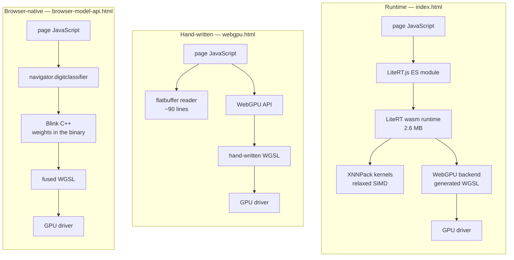

Reading down the stacks, the hand-written path removes a runtime and the
browser-native path removes JavaScript. **Both are removing layers that sit
*above* the GPU driver** — which turns out to matter, because that is not where
the cost is.

---

## 2. Startup: what each path pays before it can classify

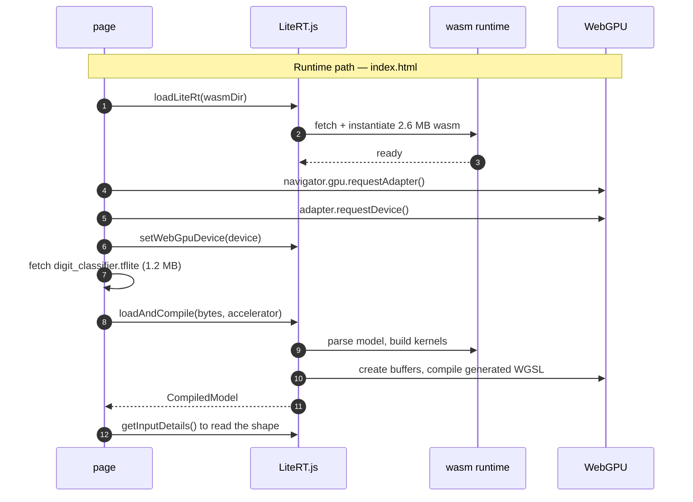

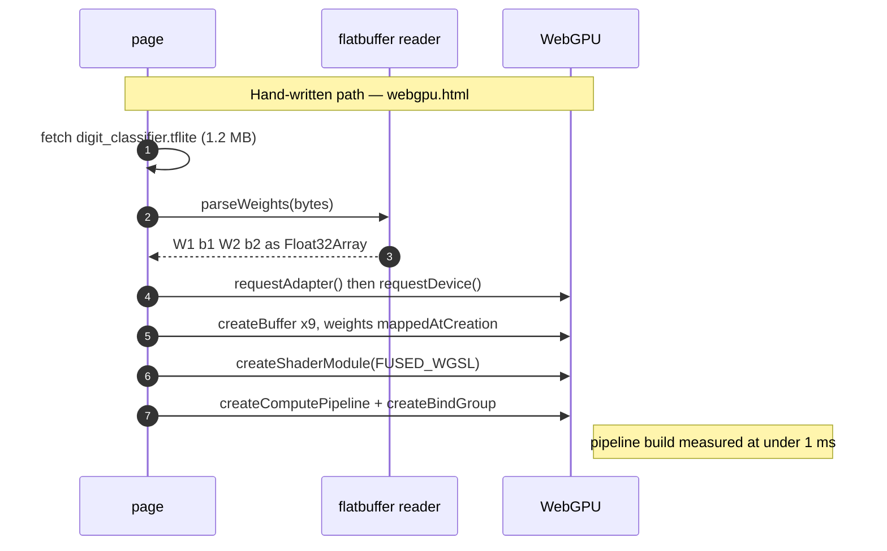

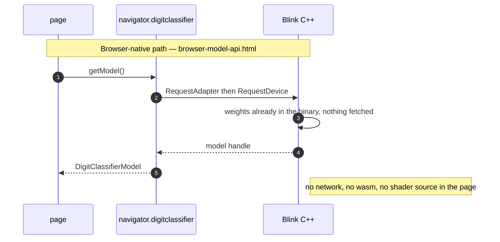

The asymmetry is stark. The runtime path fetches **3.65 MB** and compiles a model
before it can answer anything; the browser-native path fetches **nothing at all**
and its weights were linked into Chromium.

---

## 3. Steady state: the API calls that actually get timed

This is the part the benchmark measures, and where the three paths are far more
alike than their stacks suggest.

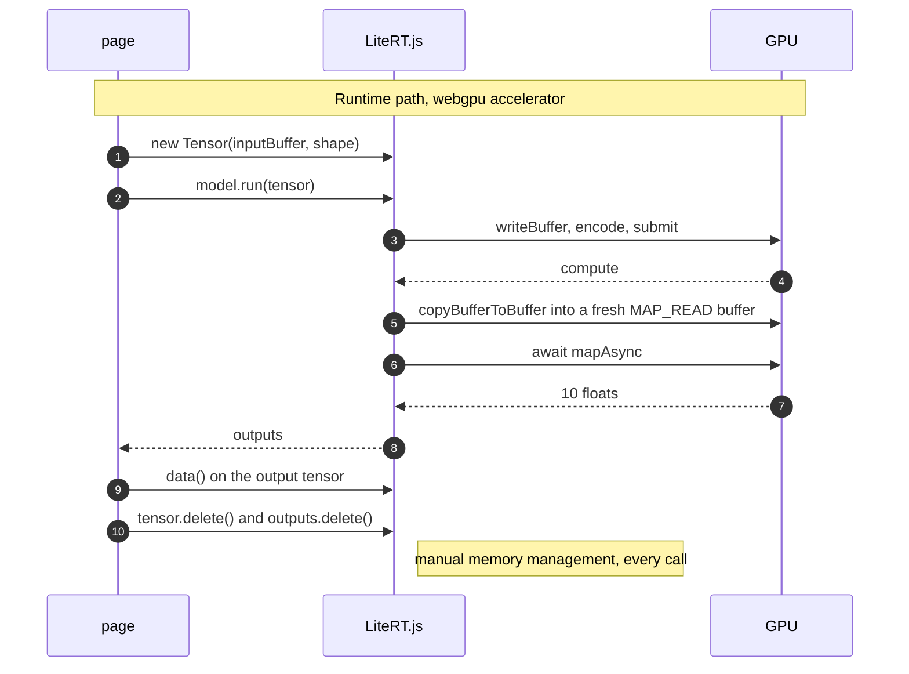

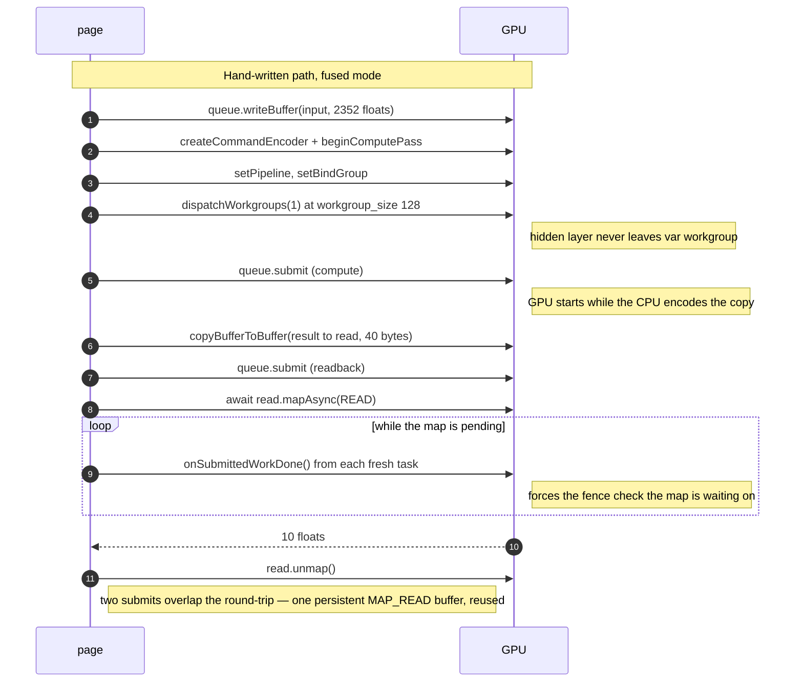

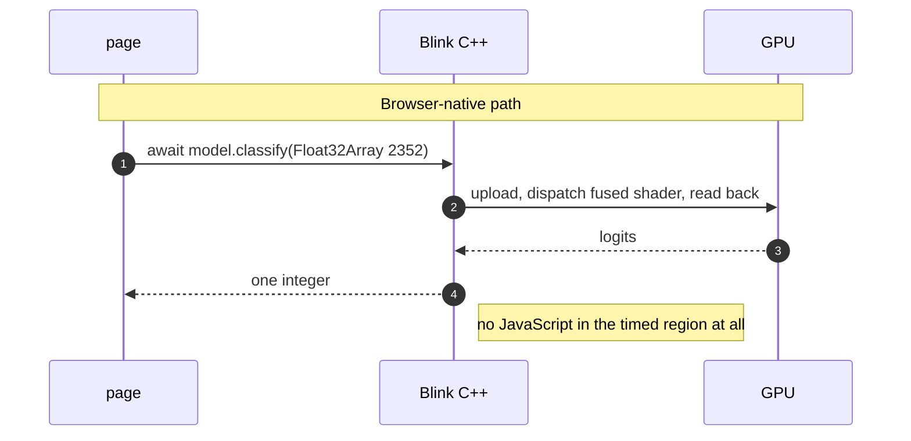

**Both GPU paths perform the same four operations**: upload the input, submit a
compute pass, copy 40 bytes back, await a map. Two differences look small and one
is not — LiteRT allocates a fresh `MAP_READ` buffer per readback where the
hand-written page reuses one (this turns out not to matter), and LiteRT issues its
readback copy in a separate encoder and submit (this is most of the 2× — it lets
the round-trip overlap; see [§6](#6-scorecard) and the
[trace](measurements/2026-08-24-litert-vs-handwritten-tracing.md)).

The CPU path has no diagram of its own because it has no round trip: `model.run`
goes into XNNPack kernels inside the wasm heap and returns. That is the whole
architectural argument for why it might win.

---

## 4. Predictions

Read only from the diagrams above, before any measurement.

### Time

| # | Prediction | Reasoning |
| --- | --- | --- |
| **T1** | Hand-written **beats** the runtime | It deletes an entire layer: no generic kernel dispatch, no runtime bookkeeping, one shader written for exactly this model. Section 1 shows LiteRT strictly above the same driver. |
| **T2** | GPU **beats** CPU | 301,056 multiply-accumulates in the first layer is embarrassingly parallel; a CPU walks it more or less serially. |
| **T3** | Browser-native is **fastest of all** | Section 2 shows it fetching nothing and section 3 shows no JavaScript in the timed region. Strictly less work than either. |

The common thread: **each prediction assumes cost lives in the layers, so
removing layers should remove cost.**

### Memory

| # | Prediction | Reasoning |
| --- | --- | --- |
| **M1** | Browser-native is smallest by a wide margin | It downloads nothing — no runtime, no model, no shader source. |
| **M2** | Hand-written sits in the middle | Page plus the 1.2 MB `.tflite`, nothing else. |
| **M3** | Runtime is largest | Everything the hand-written path needs, plus a wasm runtime and its loader. |
| **M4** | GPU-resident weights are ~1.2 MB in all three | Same 302,474 parameters at float32. Architecture cannot change this. |

---

## 5. Measured

**OnePlus 13 (CPH2653, Adreno 830), stock Chrome 150.0.7871.188**, served from
GitHub Pages over HTTPS, clocks fixed, run counts raised until each median
stopped moving. Full data in
[`2026-08-24-stock-chrome-cpu-baseline.md`](measurements/2026-08-24-stock-chrome-cpu-baseline.md)
and
[`2026-08-24-stock-chrome-litert-vs-webgpu.md`](measurements/2026-08-24-stock-chrome-litert-vs-webgpu.md).

### Time

| Path | Median | CV | vs CPU |
| --- | ---: | ---: | ---: |
| **Runtime — CPU (`wasm`)** | **0.090 ms** | 0.0% | 1.00× |
| Runtime — GPU (`webgpu`) | **1.610 ms** | 2.1% | 17.9× |
| Hand-written — fused | **3.270 ms** | 1.9% | 36.3× |

### Memory — bytes over the wire

Measured with `curl` against the live Pages site and the CDN it falls back to,
compressed as served.

| Path | Page | Model | Runtime | **Total** |
| --- | ---: | ---: | ---: | ---: |
| Runtime (`index.html`) | 9,896 | 1,126,982 | 2,689,378¹ | **3,826,256 B — 3.65 MiB** |
| Hand-written (`webgpu.html`) | 11,034 | 1,126,982 | — | **1,138,016 B — 1.09 MiB** |
| Browser-native | 8,589 | — | — | **8,589 B — 8.4 KiB** |

¹ `litert_wasm_internal.wasm` 2,612,382 + its loader 67,707 + `@litertjs/core`
8,687 + `@litertjs/wasm-utils` 602.

**445×** separates the largest from the smallest.

### Memory — decoded, and what the runtime actually costs

The wire figures understate the runtime path badly, because its bulk is
compressed wasm. Measured on the device from `PerformanceResourceTiming`
(favicon excluded):

| Path | On the wire | **Decoded** | Expansion |
| --- | ---: | ---: | ---: |
| Runtime | 3,826,256 B | **10,911,126 B — 10.41 MiB** | 2.9× |
| Hand-written | 1,138,016 B | **1,247,328 B — 1.19 MiB** | 1.1× |
| Browser-native | 8,589 B | **24,810 B — 0.02 MiB** | 2.9× |

**LiteRT's wasm alone decodes to 9,367,934 B — 8.93 MiB** from 2.6 MB on the
wire. That is 8.9 MiB of runtime code held in memory to execute a 1.2 MB model:
the runtime outweighs the thing it runs by **7.7×**.

### Memory — JS heap on the device

`Performance.getMetrics` over the DevTools socket, after a forced
`HeapProfiler.collectGarbage`. (`performance.memory` is useless here — it
returned a quantised 10,000,000 on all four configurations.)

| Config | After load | Steady, post-GC | Transient per inference |
| --- | ---: | ---: | ---: |
| Runtime — GPU | 1,695,340 B | **1,925,120 B — 1.84 MiB** | 2,106 B |
| Runtime — CPU | 1,692,912 B | **1,863,948 B — 1.78 MiB** | 1,125 B |
| Hand-written | 552,112 B | **581,924 B — 0.55 MiB** | 1,370 B |
| Browser-native | **495,484 B — 0.47 MiB** | —³ | —³ |

³ Cannot classify on stock Chrome, so only its load-time heap is observable.

Transient figures are garbage collected across ~505 inferences (5 activations ×
100 runs, plus warm-ups). **The runtime's GPU path allocates the most per
inference and is still the fastest** — 2,106 B against the hand-written page's
1,370 B, while running 2.03× quicker. Allocation volume is not what is costing
the hand-written page its time.

Raw probe output:
[`measurements/2026-08-24-stock-chrome-memory.json`](measurements/2026-08-24-stock-chrome-memory.json).

### Memory — GPU-resident

Computed exactly from `webgpu.html`, which is the only path that declares its
buffers in readable source:

| Buffer | Bytes |
| --- | ---: |
| `w1` (2352×128) | 1,204,224 |
| `w2` (128×10) | 5,120 |
| `input` (2352) | 9,408 |
| `b1`, `hidden` | 512 each |
| `b2`, `result`, `read`, `logits` | 40 each |
| **Total** | **1,219,936 B — 1.16 MiB** |

Of which **1,209,896 B is weights** — 302,474 parameters × 4. The other 10,040
bytes are working buffers. No path can do better on the weights without
quantising the model.

---

## 6. Scorecard

| # | Prediction | Outcome | |
| --- | --- | --- | --- |
| **T1** | Hand-written beats the runtime | **Wrong** — it is **2.03× slower** (3.270 vs 1.610 ms), on disjoint distributions | ❌ |
| **T2** | GPU beats CPU | **Wrong** — the CPU is **17.9× faster** | ❌ |
| **T3** | Browser-native is fastest | **Wrong**, on the evidence available² | ❌ |
| **M1** | Browser-native smallest | **Right** on all three metrics — 8.4 KiB wire, 0.02 MiB decoded, 0.47 MiB heap | ✅ |
| **M2** | Hand-written in the middle | **Right** — 1.09 MiB wire, 1.19 MiB decoded, 0.55 MiB heap | ✅ |
| **M3** | Runtime largest | **Right**, and by more than the wire suggests — 3.65 MiB wire but **10.41 MiB decoded** and 3.3× the heap | ✅ |
| **M4** | ~1.2 MB of weights everywhere | **Right** — 1,209,896 B exactly | ✅ |

² Not measurable on stock Chrome, which has no `navigator.digitclassifier`. On
the custom Chromium 153 build where it does exist it measured 2.70 ms against
2.50 ms for the hand-written page — not faster, and both far behind the CPU. A
different browser, so it is evidence rather than proof.

### Every memory prediction held. Every time prediction failed.

That split is the finding. Memory is **structural** — it follows directly from
what each path must download and allocate, so reading the architecture predicts
it exactly, and it predicts it on three independent metrics: bytes on the wire,
bytes decoded, and live JS heap all rank the three paths in the same order. Time is not, because all three predictions shared one assumption:
that cost lives in the layers, so removing layers removes cost.

Section 3 shows why that fails. Strip the runtime and you still issue
`writeBuffer` → `submit` → `mapAsync`. Strip JavaScript as well and you *still*
issue them, just from C++. The ~3 ms is that round trip, and it is charged
identically to a runtime, a hand-written page, and a browser built-in. **Layers
above the driver were never the cost.**

The CPU wins because it is the only path that never makes the round trip at all —
0.605 MFLOP finishes in 0.090 ms inside the wasm heap, while the fastest GPU path
spends 1.61 ms mostly waiting.

### What the diagrams could not have told you

The two GPU paths' per-inference sequences differ in exactly two visible ways —
LiteRT allocates a fresh `MAP_READ` buffer per call where the hand-written page
reuses one, and it splits its readback into a separate submit. The hand-written
choice looks more efficient and measures 2× slower.

The heap measurement confirms the allocation difference is real and rules out the
obvious objection: LiteRT's GPU path leaves **2,106 B** of garbage per inference
against the hand-written page's **1,370 B**, so it really is allocating more — and
winning anyway.

Of those two visible differences, the buffer is a red herring and the submit is
the point. [Tracing both paths stage by stage](measurements/2026-08-24-litert-vs-handwritten-tracing.md)
settles it: switching the hand-written `run()` to a fresh buffer per call was
*slightly slower*, not faster, so buffer reuse is not the cause. What is left is
one wait that costs **~3.3 ms** — the same whether you `mapAsync` the result or
merely `onSubmittedWorkDone`-wait for it, because it is the *waiting* that costs,
not the mapping. The hand-written `run()` fuses compute and readback into one
submit and then blocks idle on it; LiteRT's `run()` returns without syncing,
making compute and readback two submits that overlap. Keep one inference in
flight in the hand-written page and its cost falls to **0.48 ms**, beating
LiteRT.

Two fixes have since landed in `run()`, and the second reframes the wait itself.
The compute and the readback became two separate submits (**~2.75 ms** fused,
[data](measurements/2026-08-24-webgpu-two-submit.md)) — and then the rest of the
wait turned out to be **Chrome's lazy fence servicing, not a round-trip**:
left alone, the GPU process takes ~2.5 ms to notice that microseconds of work
have finished. Polling `onSubmittedWorkDone` from each fresh task while the
`mapAsync` is pending forces the check, and a 3-session re-measure lands the
median at **~0.46 ms fused / ~0.40 ms per-layer**, past LiteRT's ~1.57 ms,
bit-identical output, each call still waiting for its own result
([data](measurements/2026-08-24-webgpu-mapasync-poll.md),
[3-session](measurements/2026-08-24-fence-poll-3session.json)). The one-behind
pipeline (the 0.48 ms) remains deliberately out of the page — the poll is not
pipelining; it accelerates a single one-shot classification the same way. The
CPU's margin over the best GPU path narrows from 17.9× to ~4× and the thesis
holds either way — **but the fence-poll figure is the least settled number in
this document** (fused CV ~45%, per-layer ~56%, a ~1 ms tail every session),
because the poll's latency rides event-loop scheduling. See §7 for the shape of
it, drawn.

---

## 7. The wait, drawn

Three sequence diagrams carry the whole story of the hand-written page's time —
where it went, and how it came back. §1's stacks predicted the runtime *layers*
were the cost; these show the cost was one thing none of those layers contained:
whether anyone was asking the GPU process if the work had finished.

**Two terms this section leans on.** The CPU and GPU run in parallel — a `submit`
hands work to the GPU and returns immediately, without waiting. A **fence** is how
the CPU later learns the GPU has finished: a counter the GPU bumps ("signals") the
instant it completes a submission, which the CPU — here, Chrome's GPU process —
checks to know the results are ready and safe to read. **`mapAsync`** is how the
page reads a GPU buffer back into JavaScript; its promise resolves only once the
GPU has finished writing that buffer, which is gated on exactly that fence. So
every "wait" below is a `mapAsync` waiting on a fence — and the finding is that on
Android the fence was *signalled* on time but *checked* late.

### 7.1 Why the direct-GPU path was slow

The dispatch is 0.605 MFLOP — microseconds of arithmetic. The readback is 40
bytes. Yet a bare `await mapAsync` measured **~3.3 ms**. The reason is not a
physical CPU↔GPU round-trip: it is that after the submit, *nothing asks Chrome's
GPU process to check the completion fence*, and on Android that servicing is lazy.
The 10 result floats sit ready in the buffer for almost the entire wait.

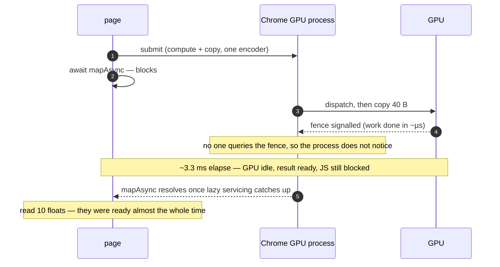

The tell was an earlier result: keeping a second inference *in flight* dropped the
per-call time to 0.48 ms. A physical round-trip cannot shrink because more work
arrives while you wait — but a lazily-polled fence resolves the instant something
makes the process look.

### 7.2 Before — one submit, block idle

The original `run()`: encode the compute pass and the 40-byte copy into one
command buffer, submit once, and block on the map. ~**3.26 ms**, nearly all of it
the lazy-fence wait above, with the CPU parked.

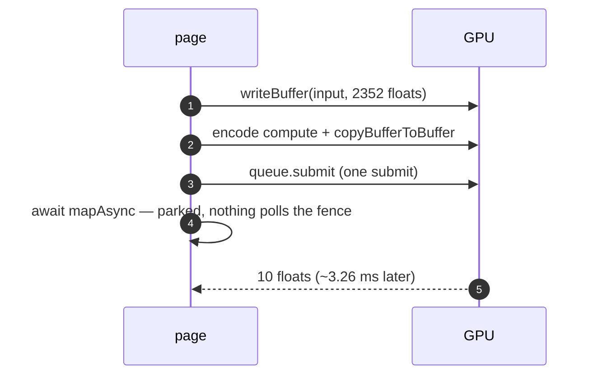

### 7.3 After — poll the fence

The current `run()`: compute and copy in **two** submits (so the GPU begins while
the CPU is still encoding the copy), then, while the map is pending, request a
fresh `onSubmittedWorkDone()` from **each macrotask** — the yield is a
`MessageChannel` message, not `setTimeout`, which would clamp the cadence to ≥1 ms
and defeat it. Every query forces the fence check the map is waiting on, and the
map resolves in ~0.4 ms. No inference is ever ahead of another: each call returns
its own result, verified bit-identical.

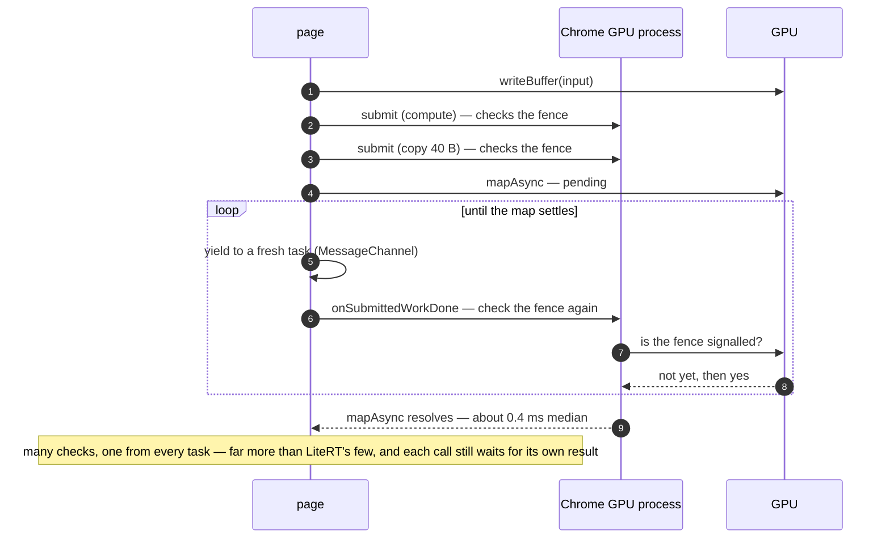

### 7.4 The three variants, side by side

| Variant | `run()` shape | fused median | CV |
| --- | --- | ---: | ---: |
| **Before** | compute + copy, one submit, `await mapAsync` | ~3.26 ms | ~2% |
| Two-submit | compute; then copy; `await mapAsync` | ~2.75 ms | — |
| **Fence-poll** | + `onSubmittedWorkDone()` per task while map pending | **~0.46 ms** | **~45%** |

Two honest caveats live in that table. First, the fence-poll is **not free**: the
loop spins the CPU issuing fence queries until the map lands, so the "fast GPU
path" now spends CPU to hurry the GPU along. Second, the **CV**: the fence-poll
median reproduces across sessions but its spread is wide and scheduling-dependent
(per-layer ~56%, a ~1 ms tail every session), because the poll's latency rides
whatever else the event loop is doing. It is at once the fastest GPU path measured
here and the least settled number in this document — both are true, and it is also
specific to stock Chrome on this Adreno; another browser or driver may service the
fence differently.

### 7.5 And LiteRT.js? It avoids the delay without fixing it

The obvious question: if the direct-GPU page was stuck at ~3.3 ms waiting on a
fence nobody checked, how does LiteRT.js reach ~1.6 ms on the *same* Chrome and
the *same* GPU? Not by fixing the delay — the lazy fence is still there. LiteRT
never polls: it issues no `onSubmittedWorkDone` and runs no loop. It stays fast
enough anyway, because of the ordinary work it does on every inference. Each of
those small operations is a piece of traffic to the GPU process, and each one
makes the process check the fence:

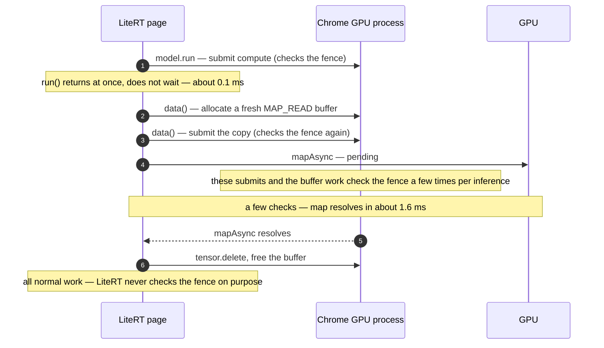

Every inference does two submits — the compute from `model.run()`, the readback
copy from `data()` — allocates and frees a fresh `MAP_READ` buffer, and deletes
its tensors. Each submit is a small piece of traffic to the GPU process, and each
one makes it check the completion fence. So the fence gets checked **a few times
per inference** — enough to resolve the map in ~1.6 ms instead of the idle page's
~3.3 ms, but far fewer times than the ~0.4 ms fence-poll, which forces a check
from *every* event-loop task.

The trace measured this shape. `model.run()` alone is **0.1 ms** — it only
enqueues. An isolated `data()` on a reused output tensor is **3.5 ms** — a full
lazy wait, because nothing is checking the fence. Yet the real `run()` → `data()`
loop is **1.6 ms**, *faster* than an isolated `data()`, because each inference's
compute submit makes the process check the earlier map
([trace](measurements/2026-08-24-litert-vs-handwritten-tracing.md)). LiteRT's
1.6 ms is the middle of the spectrum §7.4 lays out: it does not fix the lazy
fence, it just does enough normal work to keep it moving. The hand-written page,
once it stops waiting quietly and asks from every task, simply asks far more
often.

### 7.6 The C++ browser API proves the floor is real

The three points so far are all JavaScript. The custom Chromium build adds a
fourth that is not: `navigator.digitclassifier` runs the whole inference in Blink
C++, with no JavaScript in the timed region at all (§3's third diagram). If the
wait were a cost of JavaScript, the page, or the runtime, this is where it would
disappear.

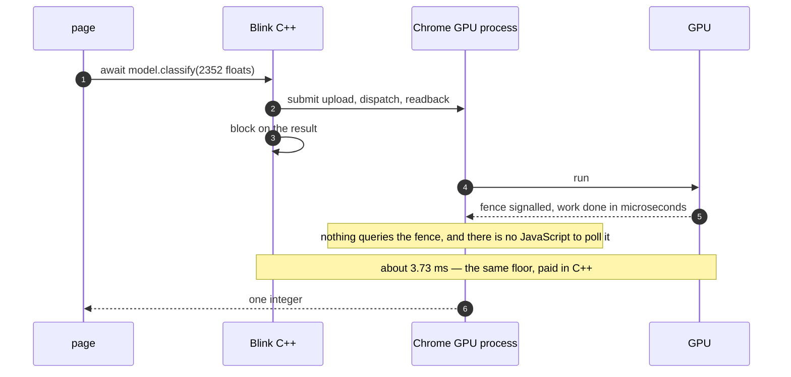

It does not disappear. Measured on the custom build it is **3.73 ms** (CV 1.7%),
the *slowest* GPU path — it does the readback the ordinary way and never pokes the
fence, so it pays the full wait every call, and the low CV is the tell: a path
sitting on the floor run after run. That confirms §7.1 from the strongest possible
direction — the ~3.3 ms is not the page, the language, or the runtime. And it
inverts the third experiment's expectation: the leanest stack is now the slowest
GPU path, because the hand-written JavaScript page beside it (0.52 ms) hurries the
GPU process along and the C++ one does not. So the full spectrum, from most checks
to none: fence-poll **0.52 ms** → LiteRT's incidental nudges **1.43 ms** →
browser-native, checks nothing, **3.73 ms**. (Custom Chromium 153, fixed-count
harness, kept apart from the stock figures;
[data](measurements/2026-08-25-custom-chromium-four-way.md).)

---

Reading an architecture predicts what it must *carry*. It does not predict what
it must *wait for* — nor that most of the wait was nobody checking whether the
waiting was over.
