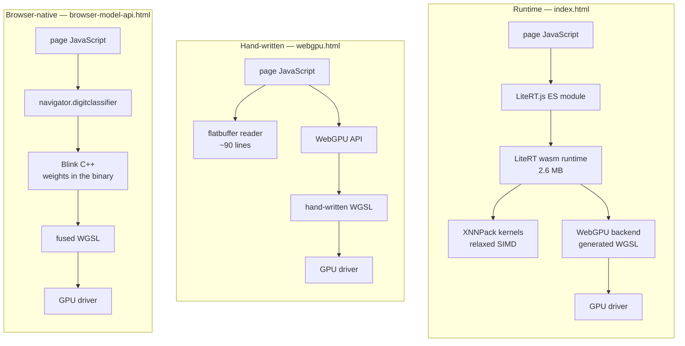
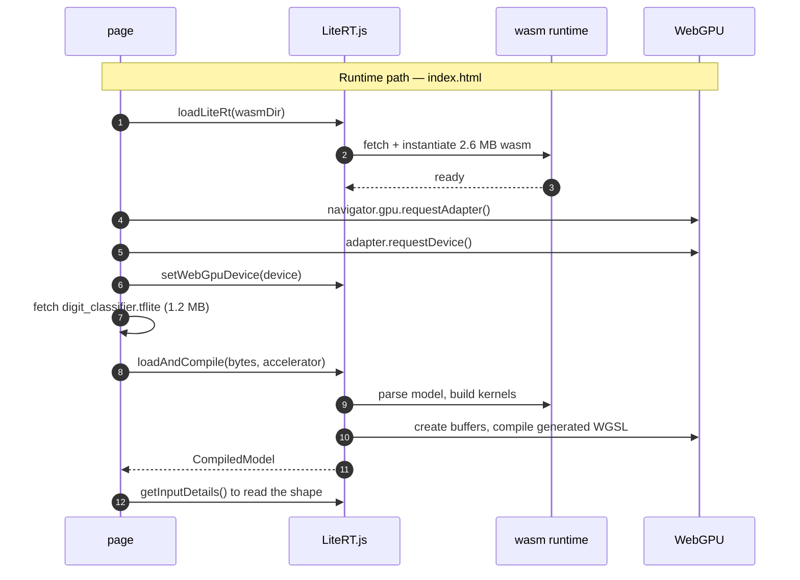
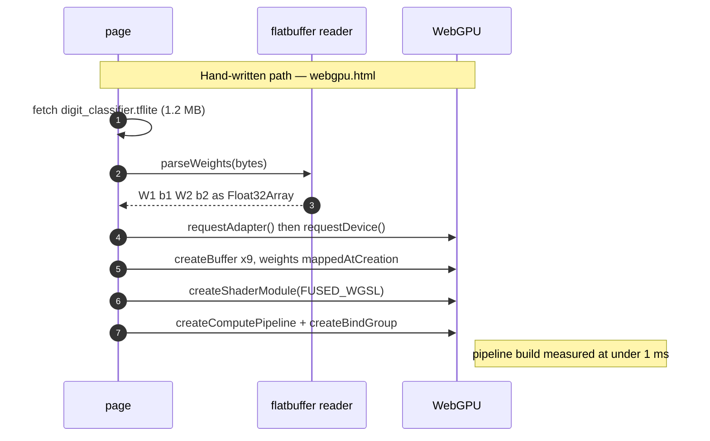
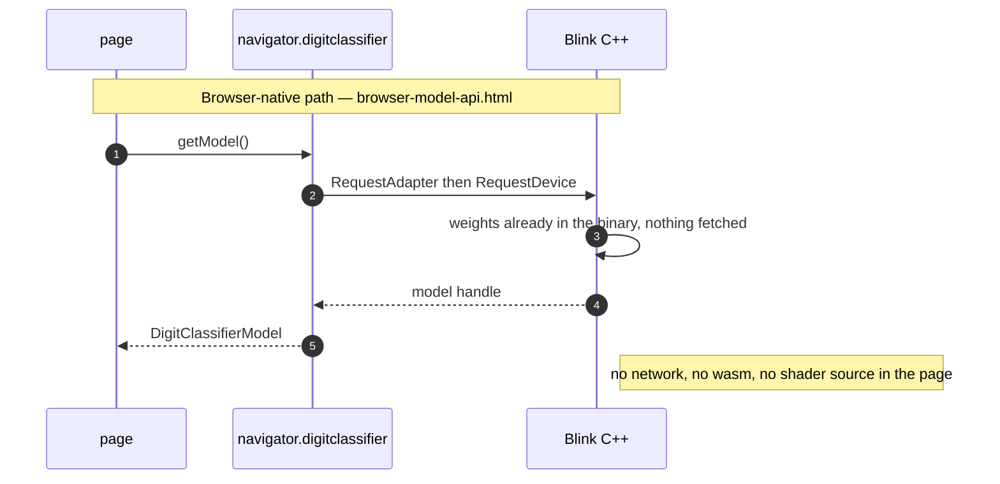
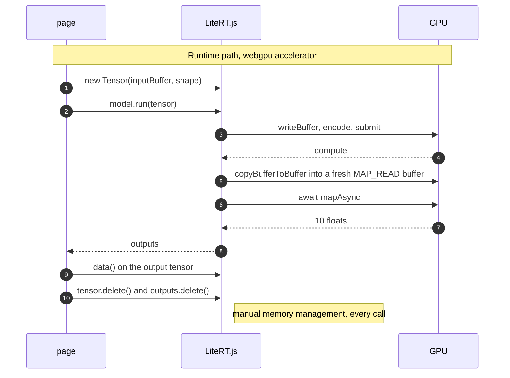
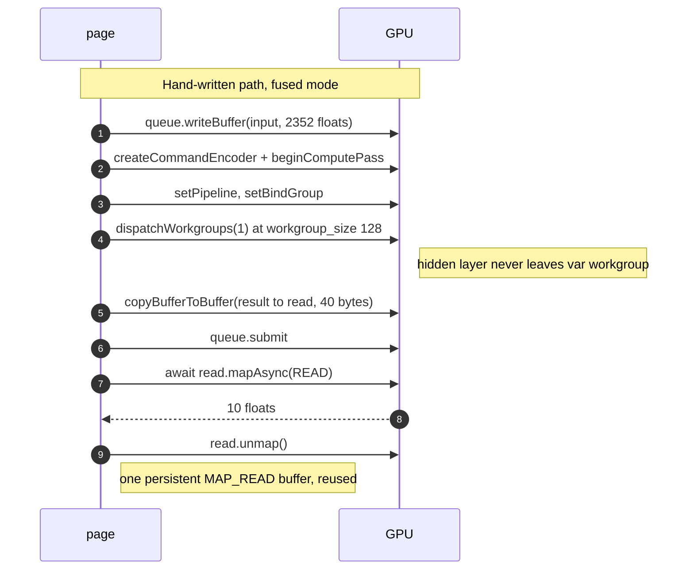
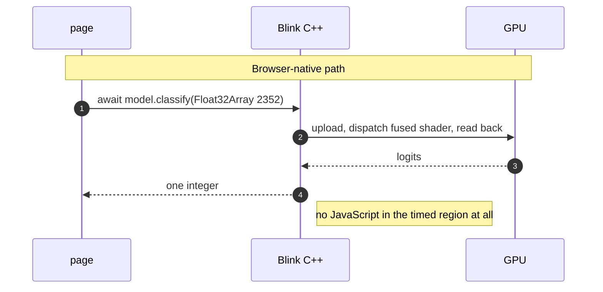

# Three Paths to One Inference

The same 302,474-parameter MNIST classifier, run three ways. This document maps
the API each path uses, then does something the repository has not done
explicitly: **it writes down what the architecture predicts, before showing what
the device measured.**

The prediction section is a genuine a-priori reading of the diagrams below. It
gets memory exactly right and time exactly backwards, which is the most useful
thing in this document.

| Path | Page | API |
| --- | --- | --- |
| **Runtime** | `index.html` | LiteRT.js — `wasm` (XNNPack) or `webgpu` |
| **Hand-written** | `webgpu.html` | WebGPU directly, WGSL written by hand |
| **Browser-native** | `browser-model-api.html` | `navigator.digitclassifier`, C++ inside Blink |

The model is identical in all three: input `[1,28,28,3]` float32 — 2352 values —
through `2352 → 128` (ReLU) `→ 10` → softmax. Every path does 0.605 MFLOP of
arithmetic per inference.

---

## 1. What each path stacks

Reading down the stacks, the hand-written path removes a runtime and the
browser-native path removes JavaScript. **Both are removing layers that sit
*above* the GPU driver** — which turns out to matter, because that is not where
the cost is.

---

## 2. Startup: what each path pays before it can classify

The asymmetry is stark. The runtime path fetches **3.65 MB** and compiles a model
before it can answer anything; the browser-native path fetches **nothing at all**
and its weights were linked into Chromium.

---

## 3. Steady state: the API calls that actually get timed

This is the part the benchmark measures, and where the three paths are far more
alike than their stacks suggest.

**Both GPU paths perform the same four operations**: upload the input, submit a
compute pass, copy 40 bytes back, await a map. The differences are real but
small — LiteRT allocates a fresh `MAP_READ` buffer per readback where the
hand-written page reuses one, and LiteRT issues its readback copy in a separate
encoder and submit.

The CPU path has no diagram of its own because it has no round trip: `model.run`
goes into XNNPack kernels inside the wasm heap and returns. That is the whole
architectural argument for why it might win.

---

## 4. Predictions

Read only from the diagrams above, before any measurement.

### Time

| # | Prediction | Reasoning |
| --- | --- | --- |
| **T1** | Hand-written **beats** the runtime | It deletes an entire layer: no generic kernel dispatch, no runtime bookkeeping, one shader written for exactly this model. Section 1 shows LiteRT strictly above the same driver. |
| **T2** | GPU **beats** CPU | 301,056 multiply-accumulates in the first layer is embarrassingly parallel; a CPU walks it more or less serially. |
| **T3** | Browser-native is **fastest of all** | Section 2 shows it fetching nothing and section 3 shows no JavaScript in the timed region. Strictly less work than either. |

The common thread: **each prediction assumes cost lives in the layers, so
removing layers should remove cost.**

### Memory

| # | Prediction | Reasoning |
| --- | --- | --- |
| **M1** | Browser-native is smallest by a wide margin | It downloads nothing — no runtime, no model, no shader source. |
| **M2** | Hand-written sits in the middle | Page plus the 1.2 MB `.tflite`, nothing else. |
| **M3** | Runtime is largest | Everything the hand-written path needs, plus a wasm runtime and its loader. |
| **M4** | GPU-resident weights are ~1.2 MB in all three | Same 302,474 parameters at float32. Architecture cannot change this. |

---

## 5. Measured

**OnePlus 13 (CPH2653, Adreno 830), stock Chrome 150.0.7871.188**, served from
GitHub Pages over HTTPS, clocks fixed, run counts raised until each median
stopped moving. Full data in
[`2026-08-24-stock-chrome-cpu-baseline.md`](measurements/2026-08-24-stock-chrome-cpu-baseline.md)
and
[`2026-08-24-stock-chrome-litert-vs-webgpu.md`](measurements/2026-08-24-stock-chrome-litert-vs-webgpu.md).

### Time

| Path | Median | CV | vs CPU |
| --- | ---: | ---: | ---: |
| **Runtime — CPU (`wasm`)** | **0.090 ms** | 0.0% | 1.00× |
| Runtime — GPU (`webgpu`) | **1.610 ms** | 2.1% | 17.9× |
| Hand-written — fused | **3.270 ms** | 1.9% | 36.3× |

### Memory — bytes over the wire

Measured with `curl` against the live Pages site and the CDN it falls back to,
compressed as served.

| Path | Page | Model | Runtime | **Total** |
| --- | ---: | ---: | ---: | ---: |
| Runtime (`index.html`) | 9,896 | 1,126,982 | 2,689,378¹ | **3,826,256 B — 3.65 MiB** |
| Hand-written (`webgpu.html`) | 11,034 | 1,126,982 | — | **1,138,016 B — 1.09 MiB** |
| Browser-native | 8,589 | — | — | **8,589 B — 8.4 KiB** |

¹ `litert_wasm_internal.wasm` 2,612,382 + its loader 67,707 + `@litertjs/core`
8,687 + `@litertjs/wasm-utils` 602.

**445×** separates the largest from the smallest.

### Memory — GPU-resident

Computed exactly from `webgpu.html`, which is the only path that declares its
buffers in readable source:

| Buffer | Bytes |
| --- | ---: |
| `w1` (2352×128) | 1,204,224 |
| `w2` (128×10) | 5,120 |
| `input` (2352) | 9,408 |
| `b1`, `hidden` | 512 each |
| `b2`, `result`, `read`, `logits` | 40 each |
| **Total** | **1,219,936 B — 1.16 MiB** |

Of which **1,209,896 B is weights** — 302,474 parameters × 4. The other 10,040
bytes are working buffers. No path can do better on the weights without
quantising the model.

---

## 6. Scorecard

| # | Prediction | Outcome | |
| --- | --- | --- | --- |
| **T1** | Hand-written beats the runtime | **Wrong** — it is **2.03× slower** (3.270 vs 1.610 ms), on disjoint distributions | ❌ |
| **T2** | GPU beats CPU | **Wrong** — the CPU is **17.9× faster** | ❌ |
| **T3** | Browser-native is fastest | **Wrong**, on the evidence available² | ❌ |
| **M1** | Browser-native smallest | **Right** — 8.4 KiB, 445× smaller than the runtime | ✅ |
| **M2** | Hand-written in the middle | **Right** — 1.09 MiB | ✅ |
| **M3** | Runtime largest | **Right** — 3.65 MiB | ✅ |
| **M4** | ~1.2 MB of weights everywhere | **Right** — 1,209,896 B exactly | ✅ |

² Not measurable on stock Chrome, which has no `navigator.digitclassifier`. On
the custom Chromium 153 build where it does exist it measured 2.70 ms against
2.50 ms for the hand-written page — not faster, and both far behind the CPU. A
different browser, so it is evidence rather than proof.

### Every memory prediction held. Every time prediction failed.

That split is the finding. Memory is **structural** — it follows directly from
what each path must download and allocate, so reading the architecture predicts
it exactly. Time is not, because all three predictions shared one assumption:
that cost lives in the layers, so removing layers removes cost.

Section 3 shows why that fails. Strip the runtime and you still issue
`writeBuffer` → `submit` → `mapAsync`. Strip JavaScript as well and you *still*
issue them, just from C++. The ~3 ms is that round trip, and it is charged
identically to a runtime, a hand-written page, and a browser built-in. **Layers
above the driver were never the cost.**

The CPU wins because it is the only path that never makes the round trip at all —
0.605 MFLOP finishes in 0.090 ms inside the wasm heap, while the fastest GPU path
spends 1.61 ms mostly waiting.

### What the diagrams could not have told you

The two GPU paths' per-inference sequences differ in exactly two visible ways —
LiteRT allocates a fresh `MAP_READ` buffer per call where the hand-written page
reuses one, and it splits its readback into a separate submit. The hand-written
choice looks more efficient and measures 2× slower. **Why is still unexplained**;
the leading hypothesis is that reusing one buffer serialises each call behind the
previous `unmap`, which is testable and untested.

Reading an architecture predicts what it must *carry*. It does not predict what
it must *wait for*.
